## 1.什么是 React?

[React](https://reactjs.bootcss.com/) 是一个用于构建用户界面的 JavaScript 库核心专注于视图,目的实现组件化开发

## 2.组件化的概念

我们可以很直观的将一个复杂的页面分割成若干个独立组件，每个组件包含自己的逻辑和样式，再将这些独立组件组合完成一个复杂的页面。这样既减少了逻辑复杂度，又实现了代码的重用。

- 可组合：一个组件可以和其他的组件一起使用或者可以直接嵌套在另一个组件内部
- 可重用：每个组件都是具有独立功能的，它可以被使用在多个场景中
- 可维护：每个小的组件仅仅包含自身的逻辑，更容易被理解和维护

## 3.react 开发环境

```bash
npm install create-react-app -g
create-react-app <project-name>
cd <project-name>
npm start
```

注：基于脚手架创建 React 工程化的项目，create-react-app 项目名称要遵循 npm 包命名规范：使用"数字、小写字母、\_"命名

<div style="color:#69b1ff;font-weight:bold">项目目录：</div>

```bash
|- node_modules
|- src：后续编写的代码「打包的时候，一般只对这个目录下的代码进行处理」
    |- index.js
|- public：放页面模板
    |- index.html
|- package.json
|- ...
```

<div style="color:#69b1ff;font-weight:bold">package.json：</div>

```json
{
  ...
  "dependencies": {
    ...
    "react": "^18.2.0",  //核心
    "react-dom": "^18.2.0",  //视图编译
    "react-scripts": "5.0.1", //对打包命令的集成
    "web-vitals": "^2.1.4"  //性能检测工具
  },
  "scripts": {
    "start": "react-scripts start", //开发环境启动web服务进行预览
    "build": "react-scripts build", //生产环境打包部署
    "test": "react-scripts test",   //单元测试
    "eject": "react-scripts eject"  //暴露配置项
  },
  "eslintConfig": {  //ESLint词法检测
    "extends": [
      "react-app",
      "react-app/jest"
    ]
  },
  "browserslist": {  //浏览器兼容列表
    "production": [
      ">0.2%",
      "not dead",
      "not op_mini all"
    ],
    "development": [
      "last 1 chrome version",
      "last 1 firefox version",
      "last 1 safari version"
    ]
  }
}
```

注：React 项目中，会默认会安装：

1. react 是 React 的核心库
2. react-dom 是提供与 DOM 相关的功能，会在 window 下增加 ReactDOM 属性，内部比较重要的方法是 render，将 react 元素或者 react 组件插入到页面中（扩展=> react-native：构建和渲染 App 的）
3. react-scripts：脚手架为了让项目目录看起来干净一些，把 webpack 打包的规则及相关的插件/LOADER 等都隐藏到了 node_modules 目录下，react-scripts 就是脚手架中自己对打包命令的一种封装，基于它打包，会调用 node_modules 中的 webpack 等进行处理

<div style="color:#69b1ff;font-weight:bold">暴露配置项：</div>

默认情况下，会把 webpack 配置项隐藏到 node_modules 中，如果想修改，则需要暴露配置项：<Badge>运行 yarn eject</Badge>

```json
/* package.json中的变化 */
{
  "dependencies":{  //暴露后，webpack中需要的模块都会列在这
     ...
  },
  "scripts": {
    "start": "node scripts/start.js",
    "build": "node scripts/build.js",
    "test": "node scripts/test.js"
    //不在基于react-scripts处理命令，而是直接基于node去执行对应的文件
    //已经没有eject命令了
  },
  "jest": {
    //单元测试配置
  },
  "babel": {  //关于babel-loader的额外配置
    "presets": [
      "react-app"
    ]
  }
}

/* 新增的内容 */
|- scripts
    |- start.js
    |- build.js
    |- ...
|- config
    |- webpack.config.js
    |- paths.js
    |- ...
```

<div style="color:#69b1ff;font-weight:bold">真实项目中常用的配置操作：</div>

1. 配置 less

```js
/*
默认安装和配置的是sass，如果需要使用less，则需要：
1. 安装
  yarn add less less-loader@8
  yarn remove sass-loader
2. 修改webpack.config.js
*/
// 72~73
const lessRegex = /\.less$/;
const lessModuleRegex = /\.module\.less$/;

//507~545
{
  test: lessRegex,
  exclude: lessModuleRegex,
  use: getStyleLoaders(
    ...
    'less-loader'
  )
},
{
  test: lessModuleRegex,
  use: getStyleLoaders(
    ...
    'less-loader'
  ),
}
```

2. 配置别名

```js
//313
resolve: {
  ...
  alias: {
    '@': path.appSrc,
    ...
  }
}
```

3. 配置预览域名

```js
// scripts/start.js
// 48
const HOST = process.env.HOST || '127.0.0.1';
// 也可以基于 cross-env 设置环境变量
```

4. 配置跨域代理

```js
/*
安装 http-proxy-middleware
yarn add http-proxy-middleware

src/setupProxy.js
*/
const { createProxyMiddleware } = require('http-proxy-middleware');
module.exports = function (app) {
  app.use(
    createProxyMiddleware('/api', {
      target: 'http://127.0.0.1:7100',
      changeOrigin: true,
      ws: true,
      pathRewrite: { '^/api': '' },
    }),
  );
};
```

5. 配置浏览器兼容

```js
//package.json
//https://github.com/browserslist/browserslist
"browserslist": {
  "production": [
    ">0.2%",
    "not dead",
    "not op_mini all"
  ],
  "development": [
    "last 1 chrome version",
    "last 1 firefox version",
    "last 1 safari version"
  ]
}

/*
CSS兼容处理：设置前缀
autoprefixer + postcss-loader + browserslist

JS兼容处理：ES6语法转换为ES5语法
babel-loader + babel-preset-react-app(@babel/preset-env) + browserslist

JS兼容处理：内置API
入口配置react-app-polyfill
*/
import 'react-app-polyfill/ie9';
import 'react-app-polyfill/ie11';
import 'react-app-polyfill/stable';
```

## 4.MVC 和 MVVM

Vue 框架采用的是 MVVM 体系，React 框架采用的是 MVC 体系。

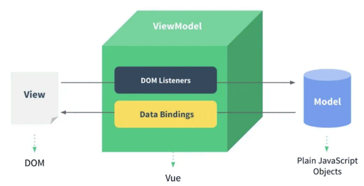

<div style="color:#69b1ff;font-weight:bold">MVVM：model 数据层 + view 视图层 + viewModel 数据/视图监听层</div>

1. 数据驱动视图的渲染：监听数据的更新，让视图重新渲染
2. 视图驱动数据的更改：监听页面中表单元素内容改变，自动去修改相关的数据
3. “双向驱动”

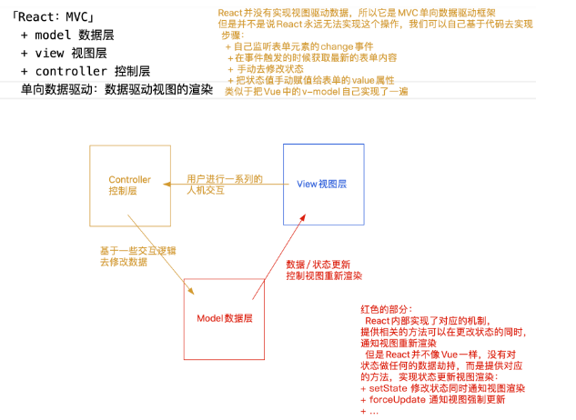

<div style="color:#69b1ff;font-weight:bold">MVC：model 数据层 + view 视图层 + controller 控制层</div>

1. 我们需要按照专业的语法去构建视图（页面）：React 中是基于 jsx 语法来构建视图的
2. 构建数据层：但凡在视图中，需要“动态”处理的(需要变化的，不论是样式还是内容)，我们都要有对应的数据模型
3. 控制层：当我们在视图中(或者根据业务需求)进行某些操作的时候，都是去修改相关的数据，然后 React 框架会按照最新的数据，重新渲染视图，以此让用户看到最新的效果，数据驱动视图的渲染
4. “单向驱动”，视图中的表单内容改变，想要修改数据，需要开发者自己去写代码实现

## 5.简介 JSX

javascript and xml（是一种 JS 和 HTML 混合的语法，将组件的结构、数据甚至样式都聚合在一起定义组件，会编译成普通的 Javascript）

:::info{title=特点}

需要注意的是 JSX 并不是 html，在 JSX 中属性不能包含关键字，像 class 需要写成 className，for 需要写成 htmlFor，并且属性名需要采用驼峰命名法。

1.  在 HTML 中嵌入“JS 表达式”，需要基于“{} 胡子语法”
2.  在 ReactDOM.createRoot()的时候，不能直接把 HTML/BODY 做为根容器，需要指定一个额外的盒子「例如：#root」
3.  最外层只能有一个根元素节点，<></> fragment 空标记，即能作为容器把一堆内容包裹起来，还不占层级结构
4.  { } 胡子语法中嵌入不同的值，所呈现出来的特点
    - number/string：值是啥，就渲染出来啥
    - boolean/null/undefined/Symbol/BigInt：渲染的内容是空
    - 除数组对象外，其余对象一般都不支持在 { } 中进行渲染，但是也有特殊情况：
      - JSX 虚拟 DOM 对象
      - 给元素设置 style 行内样式，要求必须写成一个对象格式
    - 数组对象：把数组的每一项都分别拿出来渲染「并不是变为字符串渲染，中间没有逗号」
    - 函数对象：不支持在{}中渲染，但是可以作为函数组件，用\<Component\/\>方式渲染
5.  设置行内样式，必须是对象，设置样式类名需要使用的是 className
    - 行内样式：需要基于对象的格式处理，样式属性要基于驼峰命名法处理
    ```jsx | pure
    <h2 style={{ color: 'red', fontSize: '18px' }}>
    ```
    - 设置样式类名：需要把 class 替换为 className
    ```jsx | pure
    <h2 className="box"></h2>
    ```
6.  JSX 中进行的判断一般都要基于三元运算符来完成
7.  JSX 中遍历数组中的每一项，动态绑定多个 JSX 元素，一般都是基于数组中的 map 来实现的（map 迭代数组的同时，支持返回值），和 vue 一样，循环绑定的元素要设置 key 作> 用：用于 DOM-DIFF 差异化对比）
    注：JSX 语法具备很强的编程性，JSX 语法具备过滤效果（过滤非法内容），有效防止 XSS 攻击

:::

## 6.JSX 虚拟 DOM 渲染为真实 DOM 的原理和步骤

<div style="color:#69b1ff;font-weight:bold">1. 基于 babel-presets-react-app 把 JSX 语法变为 React.createElement 的模式</div>

注：只要是元素节点，必然会基于 createElement 进行处理

> React.createElement(ele,props,...children)  
> ele：元素标签名「或组件」  
> props：元素的属性集合(对象)「如果没有设置过任何的属性，则此值是 null」  
> children：第三个及以后的参数，都是当前元素的子节点

```jsx | pure
<div style={{ color: 'red' }} className="text" id="box">
  <h1 index={1}>标题</h1>
  <span>学习REACT</span>
</div>;

React.createElement(
  'div',
  {
    style: {
      color: 'red',
    },
    className: 'text',
    id: 'box',
  },
  React.createElement(
    'h1',
    {
      index: 1,
    },
    '\u6807\u9898',
  ),
  React.createElement('span', null, '\u5B66\u4E60REACT'),
);
```

<div style="color:#69b1ff;font-weight:bold">2. 再把 createElement 方法执行，创建出 virtualDOM 虚拟 DOM 对象「也有称之为：JSX 元素、JSX 对象、ReactChild 对象...」</div>

> 首先是一个对象  
> type 属性存储的是标签名（或者组件）  
> props 属性：没有传递任何属性，也没有任何的子元素，其为空对象；把传递给 createElement 的属性，都赋值给 props；如果有子元素，则新增一个 children 的属性，可能是一个值，也可能是一个数组

```js
virtualDOM = {
  $$typeof: Symbol(react.element),
  ref: null,
  key: null,
  type: 标签名「或组件」,
  // 存储了元素的相关属性 && 子节点信息
  props: {
      元素的相关属性,
      children:子节点信息「没有子节点则没有这个属性、属性值可能是一个值、也可能是一个数组」
  }
}
```

```js
function createElement(ele, props, ...children) {
  let virtualDOM = {
    $$typeof: Symbol('react.element'),
    key: null,
    ref: null,
    type: null,
    props: {},
  };
  let len = children.length;
  virtualDOM.type = ele;
  if (props !== null) {
    virtualDOM.props = {
      ...props,
    };
  }
  if (len === 1) virtualDOM.props.children = children[0];
  if (len > 1) virtualDOM.props.children = children;
  return virtualDOM;
}
```

<div style="color:#69b1ff;font-weight:bold">3. 把构建的 virtualDOM 渲染为真实 DOM</div>

真实 DOM：浏览器页面中，最后渲染出来，让用户看见的 DOM 元素  
基于 ReactDOM 中的 render 方法处理

v16

```js
ReactDOM.render(<>...</>, document.getElementById('root'));
```

v18

```js
const root = ReactDOM.createRoot(document.getElementById('root'));
root.render(<>...</>);
```

```js
const each = function each(obj, callback) {
  if (obj === null || typeof obj !== 'object') {
    throw new TypeError('obj is not a object');
  }
  if (typeof callback !== 'function') {
    throw new TypeError('callback is not a function');
  }
  let keys = Reflect.ownKeys(obj);
  keys.forEach((key) => {
    let value = obj[key];
    // 每一次迭代，都把回调函数执行
    callback(value, key);
  });
};

/* render:把虚拟DOM变为真实DOM */
function render(virtualDOM, container) {
  let { type, props } = virtualDOM;
  if (typeof type === 'string') {
    // 存储的是标签名:动态创建这样一个标签
    let ele = document.createElement(type);
    // 为标签设置相关的属性 & 子节点
    each(props, (value, key) => {
      // className的处理：value存储的是样式类名
      if (key === 'className') {
        ele.className = value;
        return;
      }
      // style的处理：value存储的是样式对象
      if (key === 'style') {
        each(value, (val, attr) => {
          ele.style[attr] = val;
        });
        return;
      }
      // 子节点的处理：value存储的children属性值
      if (key === 'children') {
        let children = value;
        if (!Array.isArray(children)) children = [children];
        children.forEach((child) => {
          // 子节点是文本节点：直接插入即可
          if (/^(string|number)$/.test(typeof child)) {
            ele.appendChild(document.createTextNode(child));
            return;
          }
          // 子节点又是一个virtualDOM：递归处理
          render(child, ele);
        });
        return;
      }
      ele.setAttribute(key, value);
    });
    // 把新增的标签，增加到指定容器中
    container.appendChild(ele);
  }
}
```

补充说明：

1. 第一次渲染页面是直接从 virtualDOM->真实 DOM
2. 后期视图更新的时候，需要经过一个 DOM-DIFF 的对比，计算出补丁包 PATCH（两次视图差异的部分），把 PATCH 补丁包进行渲染

<div style="color:#69b1ff;font-weight:bold">JSX 渲染机制流程图：</div>

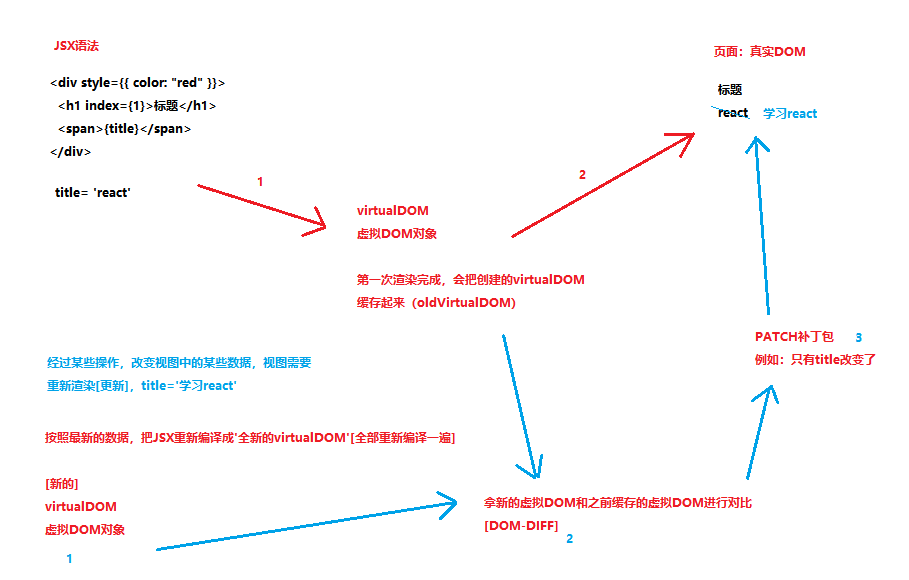

## 7.函数式组件

<div style="color:#69b1ff;font-weight:bold">函数组件</div>

DemoOne.jsx

```jsx | pure
const DemoOne = function DemoOne(props) {
  let { title, x, style } = props;
  return (
    <div className="demo" style={style}>
      <h2>{title}</h2>
      <span>{x}</span>
    </div>
  );
};

export default DemoOne;
```

`创建：`在 SRC 目录中，创建一个 xxx.jsx 的文件，就是要创建一个组件；在此文件中，创建一个函数，让函数返回 JSX 视图「或者 JSX 元素、virtualDOM 虚拟 DOM 对象」；这就是创建了一个“函数组件”

`调用：`基于 ES6Module 规范，导入创建的组件「可以忽略.jsx 后缀名」，然后像写标签一样调用这个组件即可，调用组件的时候，我们可以给调用的组件设置(传递)各种各样的属性

```jsx | pure
<DemoOne title="我是标题" x={10} style={{ fontSize: '20px' }} />
```

- 如果设置的属性值不是字符串格式，需要基于“ { } 胡子语法”进行嵌套
- 调用组件的时候，可以把一些数据/信息基于属性 props 的方式，传递给组件

`命名：`组件的名字，一般都采用 PascalCase「大驼峰命名法」这种方式命名

```jsx | pure
<Component/>  // 单闭合调用
<Component> ... </Component>  //双闭合调用
```

`渲染机制：`

1. 基于 babel-preset-react-app 把调用的组件转换为 createElement 格式

```jsx | pure
React.createElement(DemoOne, {
  title: '\u6211\u662F\u6807\u9898',
  x: 10,
  data: [100, 200],
  className: 'box',
  style: {
    fontSize: '20px',
  },
});
```

2.  把 createElement 方法执行，创建出一个 virtualDOM 对象

```json
{
    $$typeof: Symbol(react.element),
    key: null,
    props: {title: '我是标题', x: 10, style: {fontSize: '20px'}},
    //如果有子节点「双闭合调用」，则 props 也包含children
    ref: null,
    type: DemoOne
}
```

3. 基于 root.render 把 virtualDOM 变为真实的 DOM

type 值不再是一个字符串，而是一个函数了，此时：

> 把函数执行 -> DemoOne()  
> 把 virtualDOM 中的 props，作为实参传递给函数 -> DemoOne(props)  
> 接收函数执行的返回结果「也就是当前组件的 virtualDOM 对象」  
> 最后基于 render 把组件返回的虚拟 DOM 变为真实 DOM，插入到#root 容器中

`注意：`

1. 传递进来的属性是只读的（只能获取，但是不能直接修改其里面的值），如果非要修改某一个值，可以把其赋值给一个变量（状态）再去修改变量（状态）；再或者把属性深克隆出来一份，供调取和修改
2. 函数式组件属于静态组件，调取组件渲染出一个结果，后续除非重新渲染组件，否则第一次渲染的内容不会改变（当然 REACT HOOKS 可以解决这个问题）

<div style="color:#69b1ff;font-weight:bold">属性 props 的处理</div>

- 调用组件，传递进来的属性是“只读”的「原理：props 对象被冻结了」  
  Object.isFrozen(props) -> true  
  获取：props.xxx  
  修改：props.xxx=xxx =>报错

- 作用：父组件(index.jsx)调用子组件(DemoOne.jsx)的时候，可以基于属性，把不同的信息传递给子组件；子组件接收相应的属性值，呈现出不同的效果，让组件的复用性更强
- 虽然对于传递进来的属性，我们不能直接修改，但是可以做一些规则校验

  - 设置默认值

  ```json
    DemoOne.defaultProps = {
      x: 0,
      ......
    };
  ```

  - 设置其它规则，例如：数据值格式、是否必传... 「依赖于官方的一个插件：prop-types」

  传递进来的属性，首先会经历规则的校验，不管校验成功还是失败，最后都会把属性给形参 props，只不过如果不符合设定的规则，控制台会抛出警告错误{不影响属性值的获取}

  ```jsx | pure
  import PropTypes from 'prop-types';
  DemoOne.propTypes = {
    // 类型是字符串、必传
    title: PropTypes.string.isRequired,
    // 类型是数字
    x: PropTypes.number,
    // 多种校验规则中的一个
    y: PropTypes.oneOfType([PropTypes.number, PropTypes.bool]),
  };
  ```

  - 如果就想把传递的属性值进行修改，我们可以：
    - 把 props 中的某个属性赋值给其他内容「例如：变量、状态...」
    - 我们不直接操作 props.xxx = xxx，但是可以修改变量/状态值

注：函数组件是“静态组件”：

1. 组件第一次渲染完毕后，无法基于“内部的某些操作”让组件更新「无法实现“自更新”」；但是，如果调用它的父组件更新了，那么相关的子组件也一定会更新「可能传递最新的属性值进来」
2. 函数组件具备：属性...「其他状态等内容几乎没有」
3. 优势：比类组件处理的机制简单，这样导致函数组件渲染速度更快

## 8.类组件

创建类组件，创建一个构造函数(类)

> 要求必须继承 React.Component/PureComponent 这个类  
> 我们习惯于使用 ES6 中的 class 创建类「方便」  
> 必须给当前类设置一个 render 的方法「放在其原型上」：在 render 方法中，返回需要渲染的视图

从调用类组件「new Component({...})」开始，类组件内部发生的事情：

<div style="color:#69b1ff;font-weight:bold">1. 初始化属性 && 规则校验</div>

先规则校验，校验完毕后，再处理属性的其他操作

方案一：

```js
constructor(props) {
  super(props); //会把传递进来的属性挂载到 this 实例上
  console.log(this.props); //获取到传递的属性
}
```

方案二：

即便不再 constructor 中处理「或者 constructor 都没写」，在 constructor 处理完毕后，React 内部也会把传递的 props 挂载到实例上；所以在其他的函数中，只要保证 this 是实例，就可以基于 this.props 获取传递的属性，同样 this.props 获取的属性对象也是被冻结的 { 只读的 } Object.isFrozen(this.props)->true

<div style="color:#69b1ff;font-weight:bold">2. 初始化状态 </div>

状态：后期修改状态，可以触发视图的更新需要手动初始化，如果没有去做相关的处理，则默认会往实例上挂载一个 state，初始值是 null => this.state = null

```js
// 手动处理：
state = {
...
};
```

修改状态，控制视图更新

this.state.xxx=xxx ：这种操作仅仅是修改了状态值，但是无法让视图更新想让视图更新，需要基于 React.Component.prototype 提供的方法操作：

1.  this.setState(partialState 部分状态) 既可以修改状态，也可以让视图更新 「推荐」

```js
this.setState({
  xxx: xxx,
});
```

2. this.forceUpdate() 强制更新

3. 触发 componentWillMount 周期函数(钩子函数)：组件第一次渲染之前

   - 此周期函数，目前是不安全的「虽然可以用，但是未来可能要被移除了，所以不建议使用」
   - 控制会抛出黄色警告「为了不抛出警告，可以暂时用 UNSAFE_componentWillMount」
   - 如果开启了 React.StrictMode「React 的严格模式」，则使用 UNSAFE_componentWillMount 这样的周期函数，控制台会直接抛出红色警告错误

`React.StrictMode VS "use strict"`

> - "use strict"：JS 的严格模式
> - React.StrictMode：React 的严格模式，它会去检查 React 中一些不规范的语法、或者是一些不建议使用的 API 等

4. 触发 render 周期函数：渲染
5. 触发 componentDidMount 周期函数：第一次渲染完毕

   - 已经把 virtualDOM 变为真实 DOM 了「可以获取真实 DOM 」

<div style="color:#69b1ff;font-weight:bold">组件更新的逻辑「第一种：组件内部的状态被修改，组件会更新」</div>

1.  触发 shouldComponentUpdate 周期函数：是否允许更新

```jsx | pure
  shouldComponentUpdate(nextProps, nextState) {
    // nextState:存储要修改的最新状态
    // this.state:存储的还是修改前的状态「此时状态还没有改变」
    console.log(this.state, nextState);

    // 此周期函数需要返回true/false
    // 返回true：允许更新，会继续执行下一个操作
    // 返回false：不允许更新，接下来啥都不处理
    return true;
  }
```

2.  触发 componentWillUpdate 周期函数：更新之前

    - 此周期函数也是不安全的
    - 在这个阶段，状态/属性还没有被修改

3.  修改状态值/属性值「让 this.state.xxx 改为最新的值」
4.  触发 render 周期函数：组件更新

    - 按照最新的状态/属性，把返回的 JSX 编译为 virtualDOM
    - 和上一次渲染出来的 virtualDOM 进行对比「DOM-DIFF」
    - 把差异的部分进行渲染「渲染为真实的 DOM」

5.  触发 componentDidUpdate 周期函数：组件更新完毕

`特殊说明：`

如果是基于 this.forceUpdate() 强制更新视图，会跳过 shouldComponentUpdate 周期函数的校验，直接从 componentWillUpdate 开始进行更新「视图一定会触发更新」

<div style="color:#69b1ff;font-weight:bold">组件更新的逻辑「第二种：父组件更新，触发的子组件更新」</div>

1.  触发 componentWillReceiveProps 周期函数：接收最新属性之前

```jsx | pure
  UNSAFE_componentWillReceiveProps(nextProps) {
  // this.props:存储之前的属性
  // nextProps:传递进来的最新属性值
  console.log('componentWillReceiveProps:', this.props, nextProps);
  }
```

2.  触发 shouldComponentUpdate 周期函数  
    ......

<div style="color:#69b1ff;font-weight:bold">组件卸载的逻辑</div>

1. 触发 componentWillUnmount 周期函数：组件销毁之前
2. 销毁

父子组件嵌套，处理机制上遵循`深度优先`原则：父组件在操作中，遇到子组件，一定是把子组件处理完，父组件才能继续处理

- 父组件第一次渲染：  
  父 willMount -> 父 render「子 willMount -> 子 render -> 子 didMount」 -> 父 didMount

- 父组件更新：  
  父 shouldUpdate -> 父 willUpdate -> 父 render 「子 willReceiveProps -> 子 shouldUpdate -> 子 willUpdate -> 子 render -> 子 didUpdate」-> 父 didUpdate

- 父组件销毁：  
  父 willUnmount -> 处理中「子 willUnmount -> 子销毁」-> 父销毁

## 9.PureComponent

PureComponent 会给类组件默认加一个 shouldComponentUpdate 周期函数

- 在此周期函数中，它对新老的 属性/状态 会做一个浅比较
- 如果经过浅比较，发现属性和状态并没有改变，则返回 false「不更新组件」；有变化才会更新

PureComponent 原理

```js
// 检测是否为对象
const isObject = function isObject(obj) {
  return obj !== null && /^(object|function)$/.test(typeof obj);
};
// 对象浅比较的方法
const shallowEqual = function shallowEqual(objA, objB) {
  if (!isObject(objA) || !isObject(objB)) return false;
  if (objA === objB) return true;
  let keysA = Reflect.ownKeys(objA),
    keysB = Reflect.ownKeys(objB);
  if (keysA.length !== keysB.length) return false;
  for (let i = 0; i < keysA.length; i++) {
    let key = keysA[i];
    if (!objB.hasOwnProperty(key) || !Object.is(objA[key], objB[key])) {
      return false;
    }
  }
  // 以上都处理完，发现没有不相同的成员，则认为两个对象是相等的
  return true;
};

class Demo extends React.Component {
  ...
  shouldComponentUpdate(nextProps, nextState) {
      let { props, state } = this;
      // props state：修改之前的属性状态
      // nextProps nextState：将要修改的属性状态
      return !shallowEqual(props, nextProps) || !shallowEqual(state, nextState);
  }
}
```

## 10.受控组件和非受控组件

**受控组件**：基于修改数据/状态，让视图更新，达到需要的效果 「推荐」

1. 初始化状态 this.state = {}
2. 在渲染的时候使用状态 {this.state.xxx}
3. 修改状态 this.setState({xxx:xxx})，视图可更新

注：setState(partialState, callback)：部分状态、当状态更新视图重新渲染完触发的回调函数（类似于 vue 中的 $nextTick）

**非受控组件**：基于 ref 获取 DOM 元素、操作 DOM 元素，来实现需求和效果「偶尔」

基于 ref 获取 DOM 元素的语法

1.  给需要获取的元素设置 ref='xxx'，后期基于 this.refs.xxx 去获取相应的 DOM 元素「不推荐使用：在 React.StrictMode 模式下会报错」

```jsx | pure
<h2 ref="titleBox">...</h2>
// 获取：this.refs.titleBox
```

2.  把 ref 属性值设置为一个函数 ref={ x=> this.box2 = x }

    - x 是函数的形参：存储的就是当前 DOM 元素
    - 然后获取的 DOM 元素“x”直接挂在到实例的某个属性上， 获取：this.box2

3.  基于 React.createRef()方法创建一个 REF 对象

```jsx | pure
this.xxx = React.createRef(); //=> this.xxx={current:null} ref={REF 对象(this.xxx)}
//获取：this.xxx.current
```

原理：在 render 渲染的时候，会获取 virtualDOM 的 ref 属性

- 如果属性值是一个字符串，则会给 this.refs 增加这样的一个成员，成员值就是当前的 DOM 元素
- 如果属性值是一个函数，则会把函数执行，把当前 DOM 元素传递给这个函数「x->DOM 元素」,而在函数执行的内部，一般都会把 DOM 元素直接挂在到实例的某个属性上
- 如果属性值是一个 REF 对象，则会把 DOM 元素赋值给对象的 current 属性

`例子1：`

```jsx | pure
import React from 'react';

class Demo extends React.Component {
  box3 = React.createRef(); //this.box3=xxx

  render() {
    return (
      <div>
        <h2 className="title" ref="box1">
          温馨提示
        </h2>
        <h2 className="title" ref={(x) => (this.box2 = x)}>
          友情提示
        </h2>
        <h2 className="title" ref={this.box3}>
          郑重提示
        </h2>
      </div>
    );
  }
  componentDidMount() {
    // 第一次渲染完毕「virtualDOM已经变为真实DOM」：此时可以获取需要操作的DOM元素
    console.log(this.refs.box1);
    console.log(this.box2);
    console.log(this.box3.current);
  }
}

export default Demo;
```

`例子2：`

```jsx | pure
import React from 'react';

class Child1 extends React.Component {
  state = {
    x: 100,
    y: 200,
  };
  render() {
    return (
      <div>
        子组件1
        <em ref={(x) => (this.emBox = x)}>100</em>
      </div>
    );
  }
}

const Child2 = React.forwardRef(function Child2(props, ref) {
  return (
    <div>
      子组件2
      <button ref={ref}>按钮</button>
    </div>
  );
});

class Demo extends React.Component {
  render() {
    return (
      <div>
        <Child1 ref={(x) => (this.child1 = x)} />
        <Child2 ref={(x) => (this.child2 = x)} />
      </div>
    );
  }
  componentDidMount() {
    console.log(this.child1); //存储的是:子组件的实例对象
    // console.log(this.child2); //存储的是:子组件内部的button按钮
  }
}

export default Demo;

/*
 给元素标签设置ref，目的：获取对应的DOM元素 
 给类组件设置ref，目的：获取当前调用组件创建的实例「后续可根据实例获取子组件中的相关信息」
 给函数组件设置ref，直接报错：  
 Function components cannot be given refs. Attempts to access this ref will fail.
   + 但是让其配合 React.forwardRef 实现 ref 的转发
   + 目的：获取函数子组件内部的某个元素
 */
```

`实现双向数据绑定：`

```js
class Input extends Component {
  constructor() {
    super();
    this.state = { val: '100' };
  }
  handleChange = (e) => {
    let val = e.target.value;
    this.setState({ val });
  };
  render() {
    return (
      <div>
        <input
          type="text"
          value={this.state.val}
          onChange={this.handleChange}
        />
        {this.state.val}
      </div>
    );
  }
}
```

## 11.setState 更新机制

this.setState(partialState, callback)

1. partialstate: 支持部分状态更改

```jsx | pure
this.setState({
  x: 100, // 不论总共有多少状态，只修改了 x，其余的状态不动
});
```

2. callback: 在状态更改/视图更新完毕后触发执行「只要执行了 setState，callback 一定会执行」

   - 发生在 componentDidUpdate 周期函数之后「DidUpdate 会在任何状态更改后都触发执行；而回调函数方式，可以在指定状态更新后处理一些事情」
   - 特殊：即便基于 shouldComponentUpdate 阻止了状态/视图的更新，DidUpdate 周期函数肯定不会执行了，但是设置了这个 callback 回调函数依然会被触发执行！！
   - 类似于 Vue 框架中的$nextTick

3. 在 React18 和 React16 中，关于 setState 是同步还是异步，是有区别的

   `React18` 中：

   - setState 操作都是异步的「不论是在哪执行，例如：合成事件、周期函数、定时器...」 目的：实现状态的批处理「统一处理」
   - 有效减少更新次数，降低性能消耗
   - 有效管理代码执行的逻辑顺序

   原理：利用了更新队列「updater」机制来处理的

   - 在当前相同的时间段内「浏览器此时可以处理的事情中」，遇到 setState 会立即放入到更新队列中
   - 此时状态/视图还未更新
   - 当所有的代码操作结束，会“刷新队列”「通知更新队列中的任务执行」：把所有放入的 setState 合并在一起执行，只触发一次视图更新「批处理操作」

   `React16 `中：

   - 如果在合成事件，jsx 元素中基于 onXxx 绑定的事件、周期函数中，setState 的操作是异步的
   - 如果 setState 出现在其他异步操作中「例如：定时器、手动获取 DOM 元素做的事件绑定等」，它将变为同步的操作「立即更新状态和让视图渲染」

4. flushSync:可以刷新“updater 更新队列”，也就是让修改状态的任务立即批处理一次

```jsx | pure
import { flushSync } from 'react-dom';

state = {
  x: 10,
  y: 5,
  z: 0,
};

handle = () => {
  let { x, y } = this.state;
  this.setState({ x: x + 1 });
  console.log(this.state); //10/5/0
  flushSync(() => {
    this.setState({ y: y + 1 });
    console.log(this.state); //10/5/0
  });
  console.log(this.state); //11/6/0
  // 在修改 z 之前，要保证 x/y 都已经更改和让视图更新了
  this.setState({ z: this.state.x + this.state.y });
};
```

5. setState 可以传回调函数

```jsx | pure
/* 
 this.setState((prevState)=>{
    // prevState:存储之前的状态值
    // return的对象，就是想要修改的新状态值「支持修改部分状态」
    return {
        xxx:xxx
    };
 })
*/

class Demo extends React.Component {
  state = {
    x: 0,
  };

  handle = () => {
    for (let i = 0; i < 20; i++) {
      /* 
      this.setState({
                x: this.state.x + 1
      }); // 渲染一次，结果是1
      */

      this.setState((prevState) => {
        return {
          x: prevState.x + 1,
        };
      }); // 渲染一次，结果是20
    }
  };

  render() {
    console.log('视图渲染：RENDER');
    let { x } = this.state;
    return (
      <div>
        x:{x}
        <br />
        <button onClick={this.handle}>按钮</button>
      </div>
    );
  }
}

export default Demo;
```

`setState更新机制`

setState 更新队列 1:  
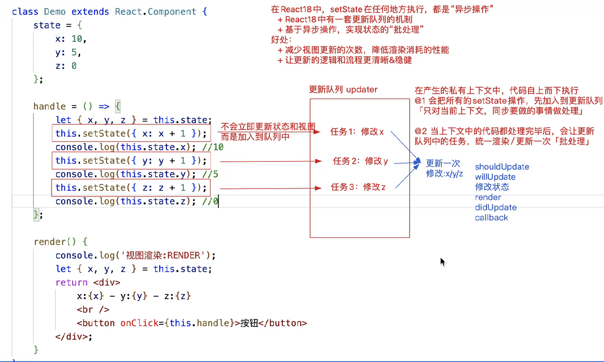

setState 更新队列 2:  
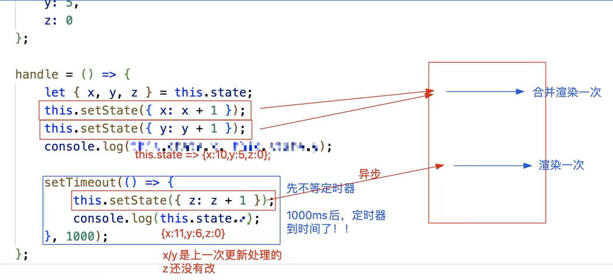

setState 更新队列 3:  
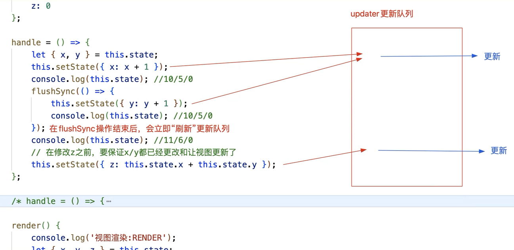

setState 更新队列 4:  
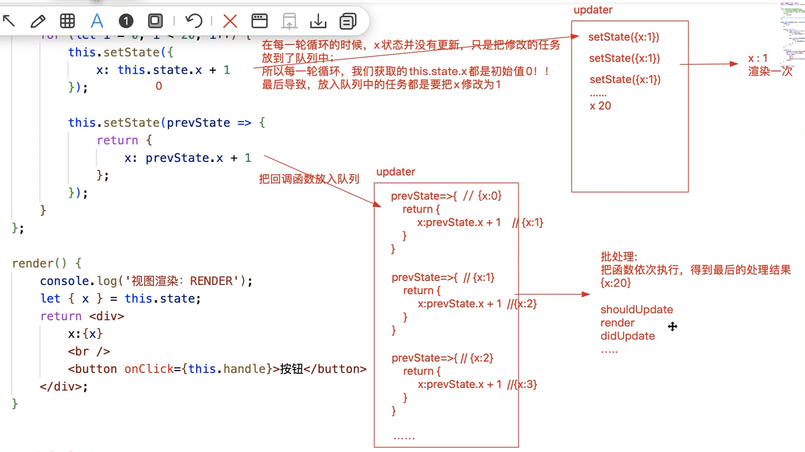

## 12.React 中的事件绑定是合成事件绑定

```jsx | pure
class Demo extends React.Component {
  /* 
基于React内部的处理，如果给合成事件绑定一个“普通函数”，当事件行为触发，绑定的函数执行；
方法中的this会是undefined「不好」  解决方案：让 this 指向实例
  + 我们可以基于JS中的bind方法：预先处理函数中的 this 和实参的
  + 推荐：也可以把绑定的函数设置为“箭头函数”，让其使用上下文中的 this

合成事件对象SyntheticBaseEvent：我们在React合成事件触发的时候，也可以获取到事件对象，
是合成事件对象「React内部经过特殊处理，把各个浏览器的事件对象统一化后，构建的一个事件对象」
  合成事件对象中，也包含了浏览器内置事件对象中的一些属性和方法「常用的基本都有」
  + clientX/clientY
  + pageX/pageY
  + target
  + type
  + preventDefault
  + stopPropagation
  + ...
  + nativeEvent：基于这个属性，可以获取浏览器内置『原生』的事件对象
  + ...
*/
  handle1() {
    //Demo.prototype.handle1 = function handle1(){}
    console.log(this); //undefined
  }
  handle2(x, y, ev) {
    // 只要方法经过bind处理了，那么最后一个实参，就是传递的合成事件对象！！
    console.log(this, x, y, ev); //实例 10 20 合成事件对象
  }
  handle3 = (ev) => {
    //实例.handle3 = () => {....}
    console.log(this); //实例
    console.log(ev);
    //SyntheticBaseEvent 合成事件对象
  };
  handle4 = (x, ev) => {
    console.log(x, ev); //10 合成事件对象
  };

  render() {
    /*
  bind在React事件绑定的中运用
    + 绑定的方法是一个普通函数，需要改变函数中的this是实例，此时需要用到bind
    + 想给函数传递指定的实参，基于bind预先处理「bind会把事件对象以最后一个实参传递给函数」 
  */
    return (
      <div>
        <button onClick={this.handle1}>按钮1</button>
        <button onClick={this.handle2.bind(this, 10, 20)}>按钮2</button>
        <button onClick={this.handle3}>按钮3</button>
        <button onClick={this.handle4.bind(null, 10)}>按钮4</button>
      </div>
    );
  }
}

export default Demo;
```

## 13.合成事件原理

React 中合成事件的处理“绝对不是”给当前元素基于 addEventListener 单独做的事件绑定，React 中的合成事件，都是基于“事件委托”处理的。

1. 在 React17 及以后版本，都是委托给#root 这个容器「捕获和冒泡都做了委托」；
2. 在 17 版本以前，都是为委托给 document 容器的「而且只做了冒泡阶段的委托」；
3. 对于没有实现事件传播机制的事件，才是单独做的事件绑定「例如 onMouseEnter/onMouseLeave...」；
4. 在捕获阶段，先注册的先执行，且 React 合成事件先于原生事件执行；冒泡阶段，先注册的后执行，且原生事件先于 React 事件执行。

在组件渲染的时候，如果发现 JSX 元素属性中有 onXxx/onXxxCapture 这样的属性，不会给当前元素直接做事件绑定，只是把绑定的方法赋值给元素的相关属性。

```jsx | pure
outer.onClick = () => {
  console.log('outer 冒泡「合成」'); //这不是DOM0级事件绑定「这样的才是 outer.onclick」
};
outer.onClickCapture = () => {
  console.log('outer 捕获「合成」');
};
inner.onClick = () => {
  console.log('inner 冒泡「合成」');
};
inner.onClickCapture = () => {
  console.log('inner 捕获「合成」');
};
```

然后对#root 这个容器做了事件绑定「捕获和冒泡都做了」

原因：因为组件中所渲染的内容，最后都会插入到#root 容器中，这样点击页面中任何一个元素，最后都会把#root 的点击行为触发！！ 而在给#root 绑定的方法中，把之前给元素设置的 onXxx/onXxxCapture 属性，在相应的阶段执行!!

合成事件的`优点：`

1. 对事件进行归类，可以在事件产生的任务上包含不同的优先级

2. 提供合成事件对象，抹平浏览器的兼容性差异

3. 减少内存消耗，提升性能，不需要注册那么多的事件了，一种事件类型只在 Root 上注册一次

4. 对开发者友好

<!--
document 捕获
body 捕获
outer 捕获「合成」
inner 捕获「合成」
root 捕获
outer 捕获「原生」
inner 捕获「原生」
inner 冒泡「原生」
outer 冒泡「原生」
inner 冒泡「合成」
outer 冒泡「合成」
root 冒泡
body 冒泡
document 冒泡
-->

```jsx | pure
class Demo extends React.Component {
  render() {
    return (
      <div
        className="outer"
        onClick={() => {
          console.log('outer 冒泡「合成」');
        }}
        onClickCapture={() => {
          console.log('outer 捕获「合成」');
        }}
      >
        <div
          className="inner"
          onClick={(ev) => {
            console.log('inner 冒泡「合成」');
          }}
          onClickCapture={() => {
            console.log('inner 捕获「合成」');
          }}
        ></div>
      </div>
    );
  }

  componentDidMount() {
    document.addEventListener(
      'click',
      () => {
        console.log('document 捕获');
      },
      true,
    );
    document.addEventListener(
      'click',
      () => {
        console.log('document 冒泡');
      },
      false,
    );

    document.body.addEventListener(
      'click',
      () => {
        console.log('body 捕获');
      },
      true,
    );
    document.body.addEventListener(
      'click',
      () => {
        console.log('body 冒泡');
      },
      false,
    );

    let root = document.querySelector('#root');
    root.addEventListener(
      'click',
      () => {
        console.log('root 捕获');
      },
      true,
    );
    root.addEventListener(
      'click',
      () => {
        console.log('root 冒泡');
      },
      false,
    );

    let outer = document.querySelector('.outer');
    outer.addEventListener(
      'click',
      () => {
        console.log('outer 捕获「原生」');
      },
      true,
    );
    outer.addEventListener(
      'click',
      () => {
        console.log('outer 冒泡「原生」');
      },
      false,
    );

    let inner = document.querySelector('.inner');
    inner.addEventListener(
      'click',
      () => {
        console.log('inner 捕获「原生」');
      },
      true,
    );
    inner.addEventListener(
      'click',
      (ev) => {
        console.log('inner 冒泡「原生」');
      },
      false,
    );
  }
}
```

React17 及以后版本

`合成事件原理图1`:

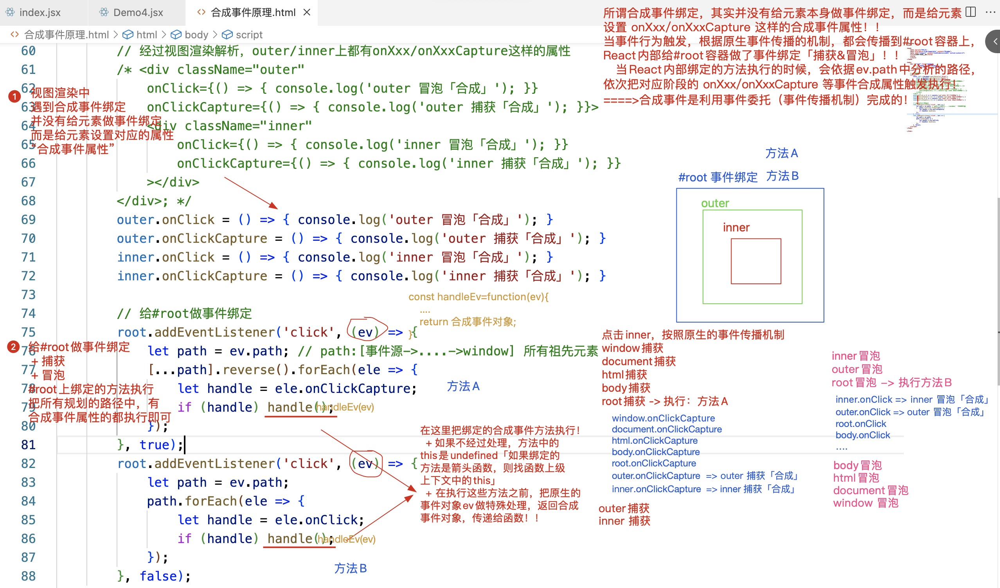

`合成事件原理图2`:

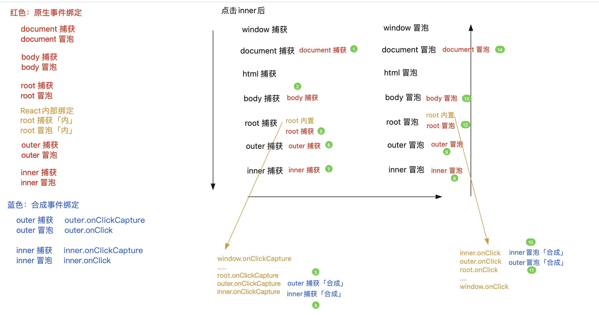

在 16 版本中，合成事件的处理机制，不再是把事件委托给#root 元素，而是委托给 document 元素，并且只做了冒泡阶段的委托；在委托的方法中，把 onXxx/onXxxCapture 合成事件属性进行执行。

React16 中，关于合成事件对象的处理，React 内部是基于“事件对象池”，做了一个缓存机制，React17 及以后，是去掉了这套事件对象池和缓存机制的。

- 当每一次事件触发的时候，如果传播到了委托的元素上「document/#root」，在委托的方法中，我们首先会对内置事件对象做统一处理，生成合成事件对象，在 React16 版本中：为了防止每一次都是重新创建出新的合成事件对象，它设置了一个事件对象池「缓存池」
- 本次事件触发，获取到事件操作的相关信息后，我们从`事件对象池`中获取存储的合成事件对象，把信息赋值给相关的成员
- 等待本次操作结束，把合成事件对象中的成员信息都清空掉，再放入到`事件对象池`中

React16 版本

`合成事件原理图1`:

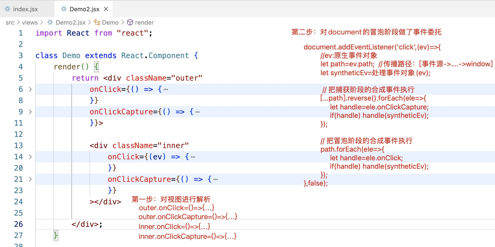

`合成事件原理图2`:

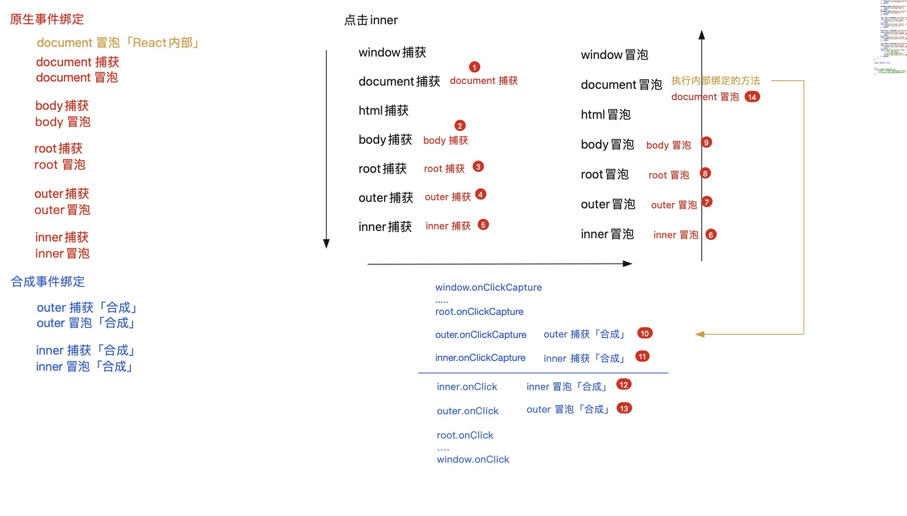

`注意：`

在 React 中，循环给元素绑定的合成事件，本身就是基于事件委托处理的，所以无需再单独设置事件委托的处理机制。

## 14.生命周期

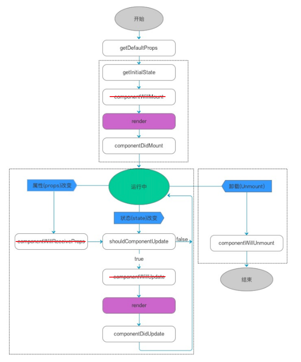

```js
shouldComponentUpdate(nextProps, nextState) {
  //原来的属性和状态
  // this.props || this.state
  //即将要改变的新状态
  // nextProps || nextState
  // return false;
}
//true允许更新，false是阻止更新（阻止的不是状态的改变，阻止的是视图是否重新渲染）

this.forceUpdate();//强制更新（跳过shouldComponentUpdate这一层，直接通知视图重新渲染）
```

## 15.React Hooks

REACT 提供的 HOOKS 函数，目的是让“函数式组件”能拥有类似于“类组件”的一些效果

函数组件「或者 Hooks 组件」不是类组件，所以没有实例的概念「调用组件不再是创建类的实例，而是把函数执行，产生一个私有上下文而已」，所以，在函数组件中不涉及 this 的处理

> 基础 Hook：  
> useState 使用状态管理  
> useEffect 使用周期函数  
> useContext 使用上下文信息

> 额外的 Hook：  
> useReducer useState 的替代方案，借鉴 redux 处理思想，管理更复杂的状态和逻辑  
> useCallback 构建缓存优化方案  
> useMemo 构建缓存优化方案  
> useRef 使用 ref 获取 DOM  
> useImperativeHandle 配合 forwardRef（ref 转发）一起使用  
> useLayoutEffect 与 useEffect 相同，但会在所有的 DOM 变更之后同步调用 effect  
>  …

> 自定义 Hook：  
>  ……

### 1.useState

目的是在函数组件中使用状态，并且后期基于状态的修改，可以让组件更新

```jsx | pure
let [num, setNum] = useState(initialValue);
```

- 执行 useState，传递的 initialValue 是初始的状态值
- 执行这个方法，返回结果是一个数组：[状态值,修改状态的方法]
  - num 变量存储的是：获取的状态值
  - setNum 变量存储的是：修改状态的方法
- 执行 setNum(value)
  - 修改状态值为 value
  - 通知视图更新

```jsx | pure
const Demo = function Demo() {
  let [num, setNum] = useState(0);
  const handle = () => {
    setNum(100);
    setTimeout(() => {
      console.log(num); // 0
    }, 2000);
  };
  return (
    <div className="demo">
      <span className="num">{num}</span>
      <Button type="primary" size="small" onClick={handle}>
        新增
      </Button>
    </div>
  );
};
```

函数组件的每一次渲染(或者是更新)，都是把函数(重新)执行，产生一个全新的“私有上下文”

- 内部的代码也需要重新执行
- 涉及的函数需要重新的构建{这些函数的作用域(函数执行的上级上下文)，是每一次执行 DEMO 产生的闭包}
- 每一次执行 DEMO 函数，也会把 useState 重新执行，但是：
  - 执行 useState，只有第一次，设置的初始值会生效，其余以后再执行，获取的状态都是最新的状态值「而不是初始值」
  - 返回的修改状态的方法，每一次都是返回一个新的

`原理：`

```jsx | pure
let _state;
function useState(initialValue) {
  if (typeof _state === 'undefined') {
    if (typeof initialValue === 'function') {
      _state = initialValue();
    } else {
      _state = initialValue;
    }
  }
  let setState = function setState(value) {
    if (Object.is(_state, value)) return;
    if (typeof value === 'function') {
      _state = value(_state);
    } else {
      _state = value;
    }
    // 通知视图更新
  };
  return [_state, setState];
}
let [num1, setNum] = useState(0); //num1=0  setNum=setState 0x001
setNum(100); //=>_state=100 通知视图更新
```

useState 自带了`性能优化的机制`：

- 每一次修改状态值的时候，会拿最新要修改的值和之前的状态值做比较「基于 Object.is 作比较」
- 如果发现两次的值是一样的，则不会修改状态，也不会让视图更新「可以理解为：类似于 PureComponent，在 shouldComponentUpdate 中做了浅比较和优化」

useState 还可以传函数（惰性化处理）

```jsx | pure
const Demo = function Demo(props) {
  // 需要把基于属性传递进来的x/y，经过其他处理的结果作为初始值
  // 此时需要对初始值的操作，进行惰性化处理：
  // 只有第一次渲染组件处理这些逻辑，以后组件更新，这样的逻辑就不会执行。
  let [num, setNum] = useState(() => {
    let { x, y } = props,
      total = 0;
    for (let i = x; i <= y; i++) {
      total += +String(Math.random()).substring(2);
    }
    return total;
  });

  const handle = () => {
    setNum(1000);
  };
  return (
    <div className="demo">
      <span className="num">{num}</span>
      <Button type="primary" size="small" onClick={handle}>
        新增
      </Button>
    </div>
  );
};
```

`useState更新机制`

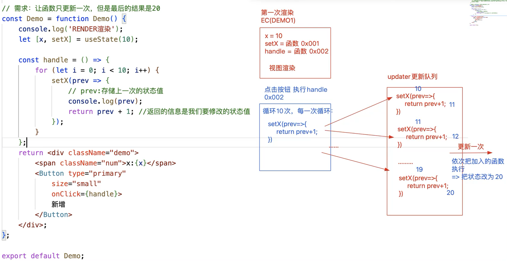

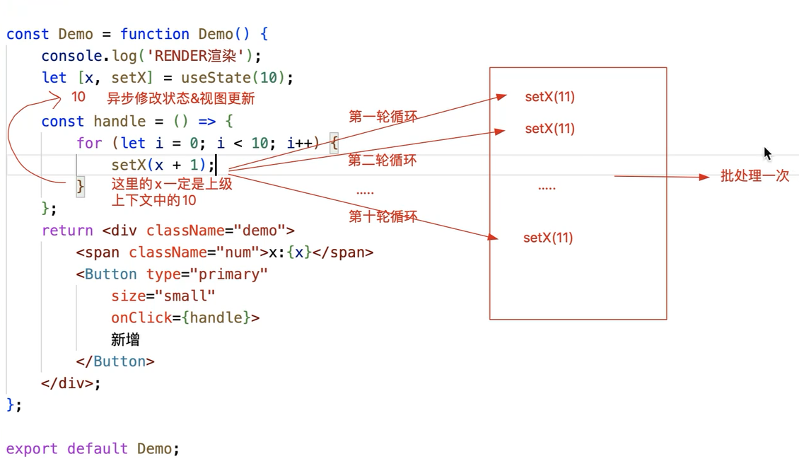

### 2.useEffect

useEffect：在函数组件中，使用生命周期函数

useEffect(callback)：没设置依赖

> 第一次渲染完毕后，执行 callback，等价于 componentDidMount  
> 在组件每一次更新完毕后，也会执行 callback，等价于 componentDidUpdate

useEffect(callback,[])：设置了，但是无依赖

> 只有第一次渲染完毕后，才会执行 callback，每一次视图更新完毕后，callback 不再执行  
> 类似于 componentDidMount

useEffect(callback,[依赖的状态(多个状态)])：

> 第一次渲染完毕会执行 callback  
> 当依赖的状态值(或者多个依赖状态中的一个)发生改变，也会触发 callback 执行  
> 但是依赖的状态如果没有变化，在组件更新的时候，callback 是不会执行的

useEffect(callback) callback 返回函数

```jsx | pure
useEffect(() => {
  return () => {
    // 返回的小函数，会在组件释放的时候执行
    // 如果组件更新，会把上一次返回的小函数执行「可以“理解为”上一次渲染的组件释放了」
  };
});
```

只能在函数**最外层**调用 Hook，不要在循环、条件判断或者子函数中调用

```jsx | pure
export default function Demo() {
  let [num, setNum] = useState(10);
  if (num >= 10) {
    // Error：React Hook "useEffect" is called conditionally.
    //React Hooks must be called in the exact same order in every component render
    //react-hooks/rules-of-hooks
    useEffect(() => {
      console.log('@1', num);
    });
  }
  return (
    <div>
      <span>{num}</span>
      <button
        onClick={() => {
          setNum(num + 1);
        }}
      >
        处理
      </button>
    </div>
  );
}
```

**异步获取数据**  
不能直接对[callback]设置 async，因为它只能返回一个函数（或者不设置返回值）

```jsx | pure
const queryData = () => {
  return fetch('/api/subscriptions/recommended_collections').then(
    (response) => {
      return response.json();
    },
  );
};
export default function Demo() {
  let [data, setData] = useState([]);
  /* Warning: useEffect must not return anything besides a function, 
  which is used for clean-up.
    useEffect(async () => {
        let result = await queryData();
        setData(result);
        console.log(result);
    }, []); 
  */
  useEffect(() => {
    const next = async () => {
      let result = await queryData();
      setData(result);
    };
    next();
  }, []);
  return <div>...</div>;
}
```

**useEffect 的原理**  
函数组件在渲染（或更新）期间，遇到 useEffect 操作，会基于 MountEffect 方法把 callback（和依赖项）加入到 effect 链表中

在视图渲染完毕后，基于 UpdateEffect 方法，通知链表中的方法执行

1. 按照顺序执行期间，首先会检测依赖项的值是否有更新「有容器专门记录上一次依赖项的值」；有更新则把对应的 callback 执行，没有则继续处理下一项！！
2. 遇到依赖项是空数组的，则只在第一次渲染完毕时，执行相应的 callback
3. 遇到没有设置依赖项的，则每一次渲染完毕时都执行相应的 callback

**useLayoutEffect 和 useEffect 区别**

useLayoutEffect 会阻塞浏览器渲染真实 DOM，优先执行 Effect 链表中的 callback； useEffect 不会阻塞浏览器渲染真实 DOM，在渲染真实 DOM 的同时，去执行 Effect 链表中的 callback；

- useLayoutEffect 设置的 callback 要优先于 useEffect 去执行！！
- 在两者设置的 callback 中，依然可以获取 DOM 元素「原因：真实 DOM 对象已经创建了，区别只是浏览器是否渲染」
- 如果在 callback 函数中又修改了状态值「视图又要更新」
  - useEffect:浏览器肯定是把第一次的真实已经绘制了，再去渲染第二次真实 DOM
  - useLayoutEffect:浏览器是把两次真实 DOM 的渲染，合并在一起渲染的

视图更新的步骤：

第一步：基于 babel-preset-react-app 把 JSX 编译为 createElement 格式  
第二步：把 createElement 执行，创建出 virtualDOM  
第三步：基于 root.render 方法把 virtualDOM 变为真实 DOM 对象「DOM-DIFF」

> useLayoutEffect 阻塞第四步操作，先去执行 Effect 链表中的方法「同步操作」  
> useEffect 第四步操作和 Effect 链表中的方法执行，是同时进行的「异步操作」

第四步：浏览器渲染和绘制真实 DOM 对象

`useEffect处理机制`

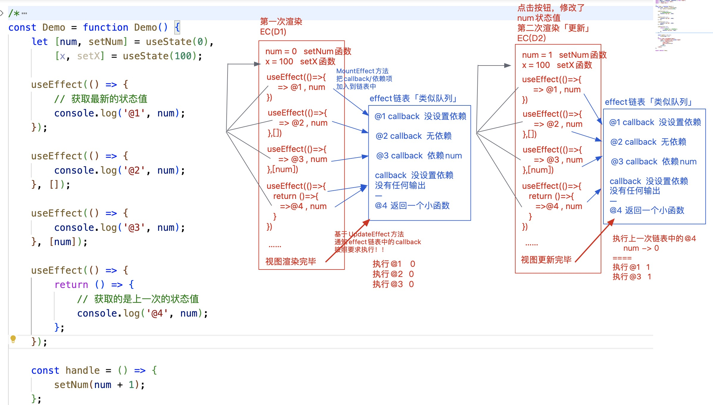

### 3.useRef

useRef

```jsx | pure
const Demo = function Demo() {
  let [num, setNum] = useState(0);
  let box = useRef(null);
  useEffect(() => {
    console.log(box.current);
  }, []);
  return (
    <div className="demo">
      <span className="num" ref={box}>
        {num}
      </span>
      <Button
        type="primary"
        size="small"
        onClick={() => {
          setNum(num + 1);
        }}
      >
        新增
      </Button>
    </div>
  );
};
```

React.createRef

```jsx | pure
const Demo = function Demo() {
  let [num, setNum] = useState(0);
  let box = React.createRef();
  useEffect(() => {
    console.log(box.current);
  }, []);
  return (
    <div className="demo">
      <span className="num" ref={box}>
        {num}
      </span>
      <Button
        type="primary"
        size="small"
        onClick={() => {
          setNum(num + 1);
        }}
      >
        新增
      </Button>
    </div>
  );
};
```

ref={函数} 「不推荐」

```jsx | pure
const Demo = function Demo() {
  let [num, setNum] = useState(0);
  useEffect(() => {
    console.log(box);
  }, []);
  return (
    <div className="demo">
      <span className="num" ref={(x) => (box = x)}>
        {num}
      </span>
      <Button
        type="primary"
        size="small"
        onClick={() => {
          setNum(num + 1);
        }}
      >
        新增
      </Button>
    </div>
  );
};
```

useRef VS React.createRef

useRef 在每一次组件更新的时候（函数重新执行），再次执行 useRef 方法的时候，不会创建新的 REF 对象了，获取到的还是第一次创建的那个 REF 对象。

总结：  
在类组件中，创建 REF 对象，基于 React.createRef 处理；但是在函数组件中，为了保证性能，应该使用专属的 useRef 处理。

```jsx | pure
let prev1, prev2;
const Demo = function Demo() {
  let [num, setNum] = useState(0);

  let box1 = useRef(null),
    box2 = React.createRef();
  if (!prev1) {
    // 第一次DEMO执行，把第一次创建的REF对象赋值给变量
    prev1 = box1;
    prev2 = box2;
  } else {
    console.log(prev1 === box1); //true
    console.log(prev2 === box2); //false
    // createRef在每一次组件更新的时候，都会创建一个全新的REF对象出来，比较浪费性能
  }

  useEffect(() => {
    console.log(box1.current);
    console.log(box2.current);
  });

  return (
    <div className="demo">
      <span className="num" ref={box1}>
        {num}
      </span>
      <span className="num" ref={box2}>
        哈哈哈
      </span>
      <Button
        type="primary"
        size="small"
        onClick={() => {
          setNum(num + 1);
        }}
      >
        新增
      </Button>
    </div>
  );
};
```

### 4.useImperativeHandle

> useImperativeHandle 可以让你在使用 ref 时自定义暴露给父组件的实例值，应当与 forwardRef 一起使用，实现 ref 转发

在类组件中，我们获取其实例后，可以直接调用实例上的方法

```jsx | pure
import React, { useEffect, useRef } from 'react';
class Child extends React.Component {
  submit = () => {
    console.log('调用了子组件的submit方法！');
  };
  render() {
    return <div>...</div>;
  }
}
export default function Demo() {
  const box = useRef(null);
  useEffect(() => {
    console.log(box.current); //子组件的实例
    box.current.submit();
  }, []);
  return (
    <div>
      <Child ref={box} />
    </div>
  );
}
```

但是直接把 ref 赋值给函数组件，是不被允许的

```jsx | pure
const Child = function () {
  return <div>...</div>;
};
export default function Demo() {
  const box = useRef(null);
  useEffect(() => {
    console.log(box.current); //null
    // Warning: Function components cannot be given refs.
    //Attempts to access this ref will fail. Did you mean to use React.forwardRef()?
  }, []);
  return (
    <div>
      <Child ref={box} />
    </div>
  );
}
```

此时我们可以基于 forwardRef 和 useImperativeHandle , 就可以实现父组件调用子组件中的方法

```jsx | pure
import React, {
  useEffect,
  useRef,
  useImperativeHandle,
  forwardRef,
} from 'react';
const Child = forwardRef(function (props, ref) {
  useImperativeHandle(ref, () => {
    return {
      submit: () => {
        console.log('调用了子组件的submit方法！');
      },
    };
  });
  return <div>...</div>;
});
export default function Demo() {
  const box = useRef(null);
  useEffect(() => {
    console.log(box.current);
    box.current.submit();
  }, []);
  return (
    <div>
      <Child ref={box} />
    </div>
  );
}
```

### 5.useMemo & useCallback

**useMemo**

let xxx = useMemo(callback,[dependencies])

> 1.第一次渲染组件的时候，callback 会执行  
> 2.后期只有依赖的状态值发生改变，callback 才会再执行  
> 3.每一次会把 callback 执行的返回结果赋值给 xxx  
> 4.useMemo 具备“计算缓存”，在依赖的状态值没有发生改变，callback 没有触发执行的时候，xxx 获取的是上一次计算出来的结果和 Vue 中的计算属性非常的类似

```jsx | pure
const Demo = function Demo() {
  let [supNum, setSupNum] = useState(10),
    [oppNum, setOppNum] = useState(5),
    [x, setX] = useState(0);
  let ratio = useMemo(() => {
    let total = supNum + oppNum,
      ratio = '--';
    if (total > 0) ratio = ((supNum / total) * 100).toFixed(2) + '%';
    return ratio;
  }, [supNum, oppNum]);

  return (
    <div className="vote-box">
      <div className="main">
        <p>支持人数：{supNum}人</p>
        <p>反对人数：{oppNum}人</p>
        <p>支持比率：{ratio}</p>
        <p>x:{x}</p>
      </div>
      <div className="footer">
        <Button type="primary" onClick={() => setSupNum(supNum + 1)}>
          支持
        </Button>
        <Button type="primary" danger onClick={() => setOppNum(oppNum + 1)}>
          反对
        </Button>
        <Button onClick={() => setX(x + 1)}>干点别的事</Button>
      </div>
    </div>
  );
};
```

总结：

useMemo 就是一个优化函数

1. 如果函数组件中，有消耗性能/时间的操作，则尽可能用 useMemo 缓存起来，设置对应的依赖
2. 这样可以保证，当非依赖的状态发生变化，不会去处理一些没有必要的操作，提高组件的更新速度

**useCallback**

- 组件第一次渲染，useCallback 执行，创建一个函数“callback”，赋值给 xxx
- 组件后续每一次更新，判断依赖的状态值是否改变，如果改变，则重新创建新的函数堆，赋值给 xxx；但是如果，依赖的状态没有更新「或者没有设置依赖“[]”」则 xxx 获取的一直是第一次创建的函数堆，不会创建新的函数出来
- 或者说，基于 useCallback，可以始终获取第一次创建函数的堆内存地址(或者说函数的引用)

```jsx | pure
let prev;
const Demo = function Demo() {
  let [x, setX] = useState(0);
  const handle = useCallback(() => {}, []); //第一次：0x001  第二次：0x001 .....
  if (!prev) {
    prev = handle;
  } else {
    console.log(handle === prev); //true
  }

  return (
    <div className="vote-box">
      <div className="main">
        <p>{x}</p>
      </div>
      <div className="footer">
        <Button type="primary" onClick={() => setX(x + 1)}>
          累加
        </Button>
      </div>
    </div>
  );
};
```

useCallback 使用场景：

父组件嵌套子组件，父组件要把一个内保的函数，基于属性传递个子组件，此时传递的这个方法，基于 useCallback 处理一下比较好

诉求：

> 当父组件更新的时候，因为传递给子组件的属性仅仅是一个函数「特点：基本应该算是不变的」，所以不想再让子组件也跟着更新了  
> 1.传递给子组件的属性（函数），每一次需要是相同的堆内存地址(是一致的) . 基于 useCallback 处理  
> 2.在子组件内部也要做一个处理，验证父组件传递的属性是否发生改变，如果没有变化，则让子组件不能更新，有变化才需要更新 . 继承 React.PureComponent 即可「在 shouldComponentUpdate 中对新老属性做了浅比较」!! 函数组件是基于 React.memo 函数，对新老传递的属性做比较，如果不一致，才会把函数组件执行，如果一致，则不让子组件更新！！

```jsx | pure
/* 子组件 */
/* class Child extends React.PureComponent {
    render() {
        console.log('Child Render');
        return <div>
            我是子组件
        </div>;
    }
} */

const Child = React.memo(function Child(props) {
  console.log('Child Render');
  return <div>我是子组件</div>;
});

/* 父组件 */
const Demo = function Demo() {
  let [x, setX] = useState(0);
  // const handle = () => { };  //第一次:0x001  第二次:0x101 ...
  const handle = useCallback(() => {}, []); //第一次:0x001  第二次:0x001 ...

  return (
    <div className="vote-box">
      <Child handle={handle} />
      <div className="main">
        <p>{x}</p>
      </div>
      <div className="footer">
        <Button type="primary" onClick={() => setX(x + 1)}>
          累加
        </Button>
      </div>
    </div>
  );
};
```

总结：

1. useCallback 可以保证，函数组件的每一次更新，不再把里面的函数重新创建，用的都是第一次创建的
2. useCallback 不要乱用，并不是所有的组件内部的函数，都拿其处理会更加好

- 虽然减少了堆内存的开辟
- 但是 useCallback 本身也有自己的处理逻辑和缓存机制，这个也消耗时间

### 6.自定义 Hook

作用：提取封装一些公共的处理逻辑  
玩法：创建一个函数，名字需要是 useXxx ，后期就可以在组件中调用这个方法

```jsx | pure
const usePartialState = function usePartialState(initialValue) {
  let [state, setState] = useState(initialValue);
  // setState:不支持部分状态更改的
  // setPartial:我们期望这个方法可以支持部分状态的更改
  const setPartial = function setPartial(partialState) {
    setState({
      ...state,
      ...partialState,
    });
  };
  return [state, setPartial];
};

// 自定义Hook，在组件第一次渲染完毕后，统一干点啥事
const useDidMount = function useDidMount(title) {
  if (!title) title = 'React系统课';
  // 基于React内置的Hook函数，实现需求即可
  useEffect(() => {
    document.title = title;
  }, []);
};

const Demo = function Demo() {
  let [state, setPartial] = usePartialState({
    supNum: 10,
    oppNum: 5,
  });

  const handle = (type) => {
    if (type === 'sup') {
      setPartial({
        supNum: state.supNum + 1,
      });
      return;
    }
    setPartial({
      oppNum: state.oppNum + 1,
    });
  };

  useDidMount('哈哈哈哈哈');

  return (
    <div className="vote-box">
      <div className="main">
        <p>支持人数：{state.supNum}人</p>
        <p>反对人数：{state.oppNum}人</p>
      </div>
      <div className="footer">
        <Button type="primary" onClick={handle.bind(null, 'sup')}>
          支持
        </Button>
        <Button type="primary" danger onClick={handle.bind(null, 'opp')}>
          反对
        </Button>
      </div>
    </div>
  );
};
```

## 16.复合组件通信方案

1. 属性传递（父传子、子传父，有共同父亲的兄弟）
2. 发布订阅（全局创建事件池）
3. 执行上下文（祖先和后代，或具备共同祖先和不相关的组件）`prop-types / createContext`

### 1. 基于 props 属性，实现父子(或兄弟)组件间的通信

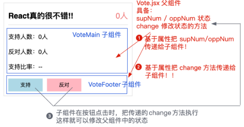

### 2. 基于 context 上下文，实现祖先/后代(或平行)组件间的通信

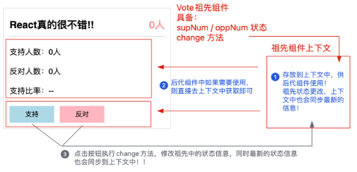

### 3. 基于 useContext ，实现祖先/后代(或平行)组件间的通信（函数组件）

ThemeContext.js

```jsx | pure
import React from 'react';
const ThemeContext = React.createContext();
export default ThemeContext;
```

Vote.jsx

```jsx | pure
import React, { useState } from 'react';
import VoteMain from './VoteMain';
import VoteFooter from './VoteFooter';
import ThemeContext from '../ThemeContext';

const Vote = function Vote() {
  let [supNum, setSupNum] = useState(10),
    [oppNum, setOppNum] = useState(5);
  const change = (type) => {
    if (type === 'sup') {
      setSupNum(supNum + 1);
      return;
    }
    setOppNum(oppNum + 1);
  };

  return (
    <ThemeContext.Provider
      value={{
        supNum,
        oppNum,
        change,
      }}
    >
      <div className="vote-box">
        <div className="header">
          <h2 className="title">React是很棒的前端框架</h2>
          <span className="num">{supNum + oppNum}</span>
        </div>
        <VoteMain />
        <VoteFooter />
      </div>
    </ThemeContext.Provider>
  );
};
```

VoteMain.jsx

```jsx | pure
import React, { useContext } from 'react';
import ThemeContext from '../ThemeContext';

const VoteMain = function VoteMain() {
  let { supNum, oppNum } = useContext(ThemeContext);
  return (
    <div className="main">
      <p>支持人数：{supNum}人</p>
      <p>反对人数：{oppNum}人</p>
    </div>
  );
};

/* const VoteMain = function VoteMain() {
    return <ThemeContext.Consumer>
        {context => {
            let { supNum, oppNum } = context;
            return <div className="main">
                <p>支持人数：{supNum}人</p>
                <p>反对人数：{oppNum}人</p>
            </div>;
        }}
    </ThemeContext.Consumer>;
}; */
```

VoteFooter.jsx

```jsx | pure
import React, { useContext } from 'react';
import ThemeContext from '../ThemeContext';

const VoteFooter = function VoteFooter() {
  let { change } = useContext(ThemeContext);
  return (
    <div className="footer">
      <Button type="primary" onClick={change.bind(null, 'sup')}>
        支持
      </Button>
      <Button type="primary" danger onClick={change.bind(null, 'opp')}>
        反对
      </Button>
    </div>
  );
};
```

## 17.高阶组件

React 高阶组件：利用 JS 中的闭包「柯理化函数」实现的组件代理，我们可以在代理组件中，经过业务逻辑的处理，获取一些信息，最后基于属性等方案，传递给我们最终要渲染的组件。

```jsx | pure
import React from 'react';

const Demo = function Demo(props) {
  console.log('Demo中的属性:', props);
  return <div className="demo">我是DEMO</div>;
};

// 执行ProxyTest方法，传递一个组件进来「Component」
const ProxyTest = function ProxyTest(Component) {
  // Component -> Demo
  return function HOC(props) {
    let isUse = false;
    // console.log(props); // {x:10,y:20,enable:true}
    // 真实要渲染的是Demo组件：把获取的props要传递给Demo
    /* let { x, y, enable } = props;
     * return <Component x={x} y={y} enable={enable} />;
     */
    return <Component {...props} isUse={isUse} />;
  };
};

export default ProxyTest(Demo);
// 把函数执行的返回结果「应该是一个组件」，基于ES6Module规范导出，供App导入使用
// 当前案例中，我们导出的是HOC「HOC：higher-order-components」
```
