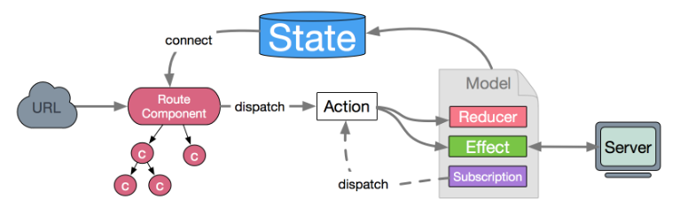
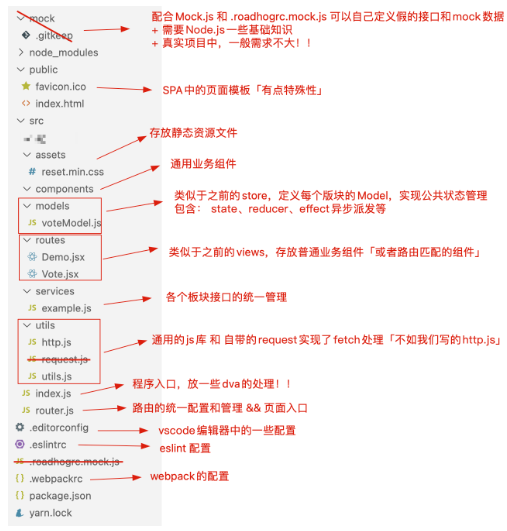

> dva 首先是一个基于 redux 和 redux-saga 的数据流方案，然后为了简化开发体验，dva 还额外内置了 react-router 和 fetch，所以也可以理解为一个轻量级的应用框架
>
> [官网](https://dvajs.com/guide/)
>
> 1. 易学易用，仅有 6 个 api，对 redux 用户尤其友好，配合 umi 使用后更是降低为 0 API
> 2. elm 概念，通过 reducers, effects 和 subscriptions 组织 model
> 3. 插件机制，比如 dva-loading 可以自动处理 loading 状态，不用一遍遍地写 showLoading 和 hideLoading
> 4. 支持 HMR，基于 babel-plugin-dva-hmr 实现 components、routes 和 models 的 HMR



## 1. 如何使用 dva

## 1.1 create-react-app 基础上使用 dva

在 create-react-app 脚手架的基础上，额外安装的内容：

- 无需手动进行 antd 按需导入
- 无需安装：redux 及 redux-saga、react-redux、react-router-dom 等，dva 把这些东西都集成好了，安装一个 dva 就相当于安装了这些全部东西！！
  - react-router-dom 使用的是 v4 版本「4.3.1」
  - redux 使用的是 v3.7.2「我们之前使用的都是 v4.0」
  - 集成的配套插件版本有点低
  - 在 React18 的脚手架中使用 dva 会有警告错误！！
- history 是控制路由模式的
- 其余的按照之前讲的配置方案去配置 webpack，包括：less、跨域代理、兼容、响应式布局等

```json
{
    "dependencies": {
        "antd": "^5.0.0",
        "antd-icons": "^0.1.0-alpha.1",
        "dva": "^2.4.1",
        "http-proxy-middleware": "^2.0.6",
        "less": "^4.1.3",
        "less-loader": "^8.1.1",
        "prop-types": "^15.8.1",
        "styled-components": "^5.3.6",
        "history": "4.10.1",
        ......
    }
}
```

项目的结构目录，可以依然沿用之前的命名风格：

- api 接口管理和请求封装
- assets 静态资源文件
- router 路由统一配置
- store redux 公共状态管理
- views 普通业务组件
- components 公共业务组件
- index.jsx 入口
- setupProxy.js 跨域代理
- …

但是有很多文件的编写方式和之前是不一样的！！

`index.js`

```jsx | pure
import dva from 'dva';
import { createHistory } from 'history';
import RouterConfig from './router';
import voteModel from './store/voteModel';

// 初始化配置
const app = dva({
  // 设置路由模式{默认HASH路由}
  history: createHistory(),
});
// 使用插件
app.use({});
// redux公共状态管理
app.model(voteModel);
// 路由配置
app.router(RouterConfig);
// 启动dva
app.start('#root');
```

`router/index.js` 配置页面入口和路由

```jsx | pure
import React from 'react';
import { Router, Route, Switch, Redirect } from 'dva/router';
import Vote from '../views/Vote';
import Demo from '../views/Demo';
/* ANTD */
import { ConfigProvider } from 'antd';
import zhCN from 'antd/locale/zh_CN';
import '../assets/reset.min.css';

function RouterConfig({ history }) {
  return (
    <ConfigProvider locale={zhCN}>
      <Router history={history}>
        <Switch>
          <Route path="/" exact component={Vote} />
          <Route path="/demo" component={Demo} />
          <Redirect to="/" />
        </Switch>
      </Router>
    </ConfigProvider>
  );
}
export default RouterConfig;
```

`store/voteModel.js` 配置每个模块的 Model，包含：状态、reducer、异步派发的方法等

```jsx | pure
import _ from '../assets/utils';
const delay = (interval = 1000) => {
  return new Promise((resolve) => {
    setTimeout(() => {
      resolve();
    }, interval);
  });
};
export default {
  namespace: 'vote',
  state: {
    supNum: 10,
    oppNum: 5,
  },
  reducers: {
    support(state, action) {
      state = _.clone(true, state);
      let { payload = 1 } = action;
      state.supNum += payload;
      return state;
    },
    oppose(state, action) {
      state = _.clone(true, state);
      let { payload = 1 } = action;
      state.oppNum += payload;
      return state;
    },
  },
  effects: {
    supportAsync: [
      function* ({ payload }, { call, put }) {
        yield call(delay, 2000);
        yield put({
          type: 'support',
          payload,
        });
      },
      { type: 'takeLatest' },
    ],
    *opposeAsync({ payload }, { call, put }) {
      yield call(delay, 2000);
      yield put({
        type: 'oppose',
        payload,
      });
    },
  },
};
```

在组件中如何使用呢

```jsx | pure
import React from 'react';
import styled from 'styled-components';
import { Button } from 'antd';
import { connect } from 'dva';

// 样式处理
const VoteBox = styled.div`
    ...
`;

const Vote = function Vote(props) {
  let { supNum, oppNum, dispatch } = props;
  return (
    <VoteBox>
      <div className="header">
        <h2 className="title">React是很棒的前端框架</h2>
        <span className="num">{supNum + oppNum}</span>
      </div>
      <div className="main">
        <p>支持人数：{supNum}人</p>
        <p>反对人数：{oppNum}人</p>
      </div>
      <div className="footer">
        <Button
          type="primary"
          onClick={() => {
            dispatch({
              type: 'vote/supportAsync',
              payload: 10,
            });
          }}
        >
          支持
        </Button>
        <Button
          type="primary"
          danger
          onClick={() => {
            dispatch({
              type: 'vote/opposeAsync',
            });
          }}
        >
          反对
        </Button>
      </div>
    </VoteBox>
  );
};
export default connect((state) => state.vote)(Vote);
```

## 1.2 用 dva 自带的脚手架创建项目

> dva 脚手架创建的项目是基于 roadhog 进行 webpack 的配置  
> roadhog 是一个 cli 工具，提供 server、 build 和 test 三个命令，分别用于本地调试和构建，并且提供了特别易用的 mock 功能。命令行体>  
> 验和 create-react-app 一致，配置略有不同，比如默认开启 css modules，然后还提供了 JSON 格式的配置方式！

```bash
npm install dva-cli -g
dva -v
dva new my-project
```

各文件说明



`package.json`

```json
{
  "private": true,
  "scripts": {
    "start": "cross-env PORT=3000 HOST=127.0.0.1 roadhog server", //开发环境启动
    "build": "roadhog build", //生产环境打包
    "lint": "eslint --ext .js src test", //单元测试
    "precommit": "npm run lint"
  },
  "dependencies": {
    "@babel/polyfill": "^7.12.1",
    "antd": "4.24.7", //注意版本用v4「不是最新的v5」
    "antd-icons": "^0.1.0-alpha.1",
    "babel-plugin-import": "^1.13.5", //antd按需导入
    "dva": "^2.4.1",
    "history": "4.10.1", //管理路由模式的「用v4不是最新的v5版本」
    "lib-flexible": "^0.3.2",
    "postcss-pxtorem": "5.1.1",
    "prop-types": "^15.8.1",
    "qs": "^6.11.0",
    "react": "^16.2.0", //react使用的是v16版本
    "react-dom": "^16.2.0",
    "styled-components": "^5.3.6"
  },
  "devDependencies": {
    "babel-plugin-dva-hmr": "^0.3.2", //热更新
    "cross-env": "^7.0.3",
    "less": "4.1.3",
    "less-loader": "8.1.1",
    ...
  }
}
```

`修改webpack配置项`

修改启动的域名和端口号：设置环境变量即可

- PORT
- HOST
- HTTPS 是否开启 https,默认关闭
- BROWSER 设为 none 时不自动打开浏览器
- CLEAR_CONSOLE 设为 none 时清屏

```bash
start: cross-env PORT=3000 HOST=127.0.0.1 roadhog server
```

把`.webpackrc` 改为`.webpackrc.js`，这样就可以按照 JS 方式去编写配置项了！！

- 修改入口、出口、打包配置等
- Antd 按需导入
- 配置跨域代理
- 配置响应式布局方案
- 配置 less
- 不同环境下的配置
- 浏览器兼容
- ……

```json
import px2rem from 'postcss-pxtorem';
export default {
    /* 基础配置 */
    "entry": "src/index.js", //配置多入口：src/enter/*.js
    "outputPath": "./dist",
    "publicPath": "/",
    "hash": true,
    "html": {
        "template": "./public/index.ejs"
    },
    /* 配置LESS */
    "disableCSSModules": true,
    /* 配置PX转REM */
    "extraPostCSSPlugins": [
        px2rem({
            "rootValue": 75,
            "propList": ['*']
        })
    ],
    /* 配置BABEL的插件 */
    "extraBabelPlugins": [
        // antd按需导入
        [
            "import",
            {
                "libraryName": "antd",
                "libraryDirectory": "es",
                "style": "css"
            }
        ],
        // 配置PX转REM
        [
            "styled-components-px2rem",
            {
                "rootValue": 75
            }
        ]
    ],
    /* 配置跨域代理 */
    "proxy": {
        "/api": {
            "target": "https://news-at.zhihu.com/api/4",
            "changeOrigin": true,
            "ws": true,
            "pathRewrite": {
                "/api": ""
            }
        }
    },
    /* 不同环境下的不同配置 */
    "env": {
        "development": {
            "extraBabelPlugins": [
                "dva-hmr"
            ]
        }
    }
};
```

浏览器兼容：默认情况下，ES6 语法和 CSS3 的兼容已经处理，如果想处理 ES6 内置 API 的兼容，则导入@babel/polyfill 即可「入口导入」！！

## 2. dva 中的路由配置

`index.js`

```jsx | pure
import dva from 'dva';
/*
 安装history模块「安装v4.10.1版本，不建议安装最新版本」
 $ yarn add history@4.10.1
 默认开启的就是HASH路由，如果想使用History路由，则导入createBrowserHistory!!
*/
import {createHistory} from 'history';
const app = dva({
    // 指定路由模式
    history: createHistory()
});
...
app.router(require('./router').default);
app.start('#root');
```

`router.js`

```jsx | pure
/*
dva/router中包含了react-router-dom v5版本中所有API，以及react-router-redux中的的API
*/
import React from 'react';
import { Router, Route, Switch, Redirect } from 'dva/router';
import Vote from './routes/Vote';
import Demo from './routes/Demo';
import Personal from './routes/Personal';

/* ANTD */
...

const RouterConfig = function RouterConfig({ history }) {
  return <ConfigProvider locale={zhCN}>
    <Router history={history}>
      <Switch>
        <Route path="/" exact component={Vote} />
        <Route path="/demo" component={Demo} />
        <Route path="/personal" component={Personal} />
        <Redirect to="/" />
      </Switch>
    </Router>
  </ConfigProvider>;
}
export default RouterConfig;
```

`路由懒加载`

```jsx | pure
import React from 'react';
import { Router, Route, Switch, Redirect } from 'dva/router';
import Vote from './routes/Vote';
import dynamic from 'dva/dynamic'; //实现动态组件的API

/* ANTD */
...

const RouterConfig = function RouterConfig({ history, app }) {
  /* 异步组件 */
  const DemoAsync = dynamic({
    app,
    models: () => [
      import(/* webpackChunkName:"demo" */ './models/demoModel')
    ],
    component: () => import(/* webpackChunkName:"demo" */ './routes/Demo')
  });
  const PersonalAsync = dynamic({
    app,
    models: () => [
      import(/* webpackChunkName:"personal" */ './models/personalModel')
    ],
    component: () => import(/* webpackChunkName:"personal" */ './routes/Personal')
  });

  return <ConfigProvider locale={zhCN}>
    <Router history={history}>
      <Switch>
        <Route path="/" exact component={Vote} />
        <Route path="/demo" component={DemoAsync} />
        <Route path="/personal" component={PersonalAsync} />
        <Redirect to="/" />
      </Switch>
    </Router>
  </ConfigProvider>;
}
export default RouterConfig;
```

`配置路由表和二级路由`

routerRoutes.js 路由表

```jsx | pure
import Vote from './routes/Vote';
import dynamic from 'dva/dynamic';
/* 配置路由懒加载 */
const lazy = function lazy(models, component) {
  return dynamic({
    app: window.app, //在入口处挂载到window上
    models,
    component,
  });
};

const routes = [
  {
    path: '/',
    exact: true,
    component: Vote,
    meta: { title: '首页' },
  },
  {
    path: '/demo',
    component: lazy(
      () => [import(/* webpackChunkName:"demo" */ './models/demoModel')],
      () => import(/* webpackChunkName:"demo" */ './routes/Demo'),
    ),
    meta: { title: '测试页' },
  },
  {
    path: '/personal',
    component: lazy(
      () => [
        import(/* webpackChunkName:"personal" */ './models/personalModel'),
      ],
      () => import(/* webpackChunkName:"personal" */ './routes/Personal'),
    ),
    meta: { title: '个人中心' },
    /* 二级路由 */
    children: [
      {
        redirect: true,
        exact: true,
        from: '/personal',
        to: '/personal/order',
      },
      {
        path: '/personal/order',
        component: lazy(
          () => [],
          () =>
            import(
              /* webpackChunkName:"personal" */ './routes/personal/MyOrder'
            ),
        ),
        meta: { title: '个人中心-我的订单' },
      },
      {
        path: '/personal/profile',
        component: lazy(
          () => [],
          () =>
            import(
              /* webpackChunkName:"personal" */ './routes/personal/MyProfile'
            ),
        ),
        meta: { title: '个人中心-我的信息' },
      },
    ],
  },
  {
    redirect: true,
    to: '/',
  },
];
export default routes;
```

`router.js`

```jsx | pure
import React from 'react';
import { Router, Route, Switch, Redirect } from 'dva/router';
import routes from './routerRoutes';
/* ANTD */
...
/* 动态创建路由 */
const createRoute = function createRoute(routes) {
  return <Switch>
    {routes.map((item, index) => {
      let { redirect, from, to, exact, path, meta, component: Component } = item,
        config = {};
      // 重定向
      if (redirect) {
        config = { to };
        if (from) config.from = from;
        if (exact) config.exact = exact;
        return <Redirect {...config} key={index} />;
      }
      // 正常路由
      config = { path };
      if (exact) config.exact = exact;
      return <Route {...config} key={index}
        render={(props) => {
          // 修改标题
          let { title = '' } = meta;
          document.title = `${title}-珠峰培训React`;
          return <Component {...props} />;
        }} />;
    })}
  </Switch>;
};
/* 一级路由 */
const RouterConfig = function RouterConfig({ history }) {
  return <ConfigProvider locale={zhCN}>
    <Router history={history}>
      {createRoute(routes)}
    </Router>
  </ConfigProvider>;
};
/* 二级路由 */
export const childrenRouter = function childrenRouter(path) {
  let item = routes.find(item => item.path === path),
    children;
  if (item) children = item.children;
  if (!children) return null;
  return createRoute(children);
};
export default RouterConfig;
```

`index.js`

```jsx | pure
import dva from 'dva';
import createHistory from 'history/createHashHistory';
import voteModel from './models/voteModel';
// 1. Initialize
const app = dva({
  history: createHistory(),
});
window.app = app;
// 2. Plugins
// app.use({});
// 3. Model
app.model(voteModel);
// 4. Router
app.router(require('./router').default);
// 5. Start
app.start('#root');
```

`Personal.jsx`

```jsx | pure
import React from 'react';
import { NavLink } from 'dva/router';
import styled from 'styled-components';
import { childrenRouter } from '../router';
/* 样式处理 */
const PersonalBox = styled.div`
    ...
`;
const Personal = function Personal() {
  return (
    <PersonalBox>
      <div className="menu">
        <NavLink to="/personal/order">我的订单</NavLink>
        <NavLink to="/personal/profile">我的信息</NavLink>
      </div>
      <div className="content">{childrenRouter('/personal')}</div>
    </PersonalBox>
  );
};
export default Personal;
```

`路由跳转及传参`

方案一：Link 和 NavLink

NavLink 可以和路由地址进行匹配，设置选中样式！！

```jsx | pure
<div className="menu">
  <NavLink to="/personal/order">我的订单</NavLink>
  <NavLink to="/personal/profile">我的信息</NavLink>
</div>
```

方案二：编程式导航

```jsx | pure
import React from 'react';
import { routerRedux } from 'dva/router';
import { connect } from 'dva';

const MyOrder = function MyOrder(props) {
  /* 
    基于路由匹配的组件，其属性中包含：history、location、match！
      其中history就是实现路由跳转的
        + push
        + replace
        + go
        + goBack
        + goForward
      如果组件不是基于路由匹配的，可以基于 withRouter 高阶函数处理即可！！
    */
  let { history, dispatch } = props;
  return (
    <div className="myOrderBox">
      我的订单
      <button
        onClick={() => {
          // history.push('/personal/profile');

          /* 
             routerRedux 也可以实现路由跳转，语法和history类似
             好处：可以在Effects中基于 yield 实现路由跳转
                // Inside Effects
                yield put(routerRedux.push('/logout'));

                // Outside Effects
                dispatch(routerRedux.push('/logout'));
             */
          dispatch(routerRedux.push('/personal/profile'));
        }}
      >
        跳转
      </button>
    </div>
  );
};
export default connect()(MyOrder);
```

## 3. dva 中 Model 处理

`入口`

```jsx | pure
import voteModel from './models/voteModel';
...
app.model(voteModel);
...
```

`基本结构`

```jsx | pure
export default {
  // 命名空间「模块名：后期获取状态和派发都需要这个名字」
  namespace: 'vote',
  // 此模块管理的公共状态
  state: {},
  // 此模块需要判断的reducer「同步派发直达reducers」
  reducers: {},
  // 此模块需要异步派发的任务「基于redux-saga语法处理」
  effects: {},
  // 订阅方法，一开始就自动执行「获取数据，实现派发等」
  subscriptions: {},
};
```

`实现计数器累计 `

Demo.jsx

```jsx | pure
import React from "react";
import styled from "styled-components";
import { connect } from 'dva'
import { Button } from 'antd';
...
const Demo = function Demo(props) {
    let { num, dispatch } = props;
    return <DemoBox>
        <span className="num">{num}</span>
        <Button type="primary"
            onClick={() => {
                dispatch({
                    type: "demo/increment",
                    payload: 5
                });
            }}>
            按钮
        </Button>
        <Button type="primary" danger
            onClick={() => {
                dispatch({
                    type: 'demo/incrementAsync',
                    payload: 10
                });
            }}>
            异步按钮
        </Button>
    </DemoBox>;
};
export default connect(state => state.demo)(Demo);
```

`demoModel.js`

```jsx | pure
import _ from '../utils/utils';
const delay = (interval = 1000) => {
    ...
};
export default {
    namespace: 'demo',
    state: {
        num: 0
    },
    reducers: {
        increment(state, action) {
            state = _.clone(true, state);
            let { payload = 1 } = action;
            state.num += payload;
            return state;
        }
    },
    effects: {
        *incrementAsync({ payload }, { call, put }) {
            yield call(delay, 2000);
            yield put({
                type: 'increment',
                payload
            });
        }
    }
};
```

`effects中的特殊处理`

```jsx | pure
effects: {
  incrementAsync: [
    function* ({ payload }, { call, put, select }) {
      try {
        // 获取状态
        let { num } = yield select((state) => state.demo);
        // 发送请求
        yield call(delay, 2000);
        // 派发任务
        yield put({
          type: 'increment',
          payload,
        });
      } catch (err) {
        // 异常捕获
        console.log(err);
      }
    },
    // 指定监听的类型，默认是takeEvery「还有：takeLatest、throttle等」
    { type: 'takeLatest' },
    // { type: "throttle", ms: 1000 }
  ];
}
```

`subscriptions`

```jsx | pure
app.model({
  subscriptions: {
    setup({ dispatch, history }) {
      history.listen((location) => {
        if (location.pathname === '/demo') {
          dispatch({
            type: 'demo/increment',
            payload: 100,
          });
        }
      });
    },
  },
});
```

## 4. dva-loading 插件的应用

> dva-loading 会监听指定的异步请求方法，方法开始时 loading 状态值为 true ，异步结束后该值自动置为 false , 可用于骨架屏或某些需要 loading 状态的场景！

```bash
yarn add dva-loading
```

index.js

```jsx | pure
import createLoading from 'dva-loading';
...
app.use(createLoading());
...
```

models/demoModel.js

```jsx | pure
const delay = (interval = 1000) => {
    ...
};
export default {
    namespace: 'demo',
    state: {
        num: 0
    },
    reducers: {
        test(state) {
            state = { ...state };
            state.num++;
            return state;
        }
    },
    effects: {
        *testAsync(action, { call, put }) {
            yield call(delay, 2000);
            yield put({
                type: 'test'
            });
        }
    }
};
```

组件中使用

```jsx | pure
import { connect } from "dva";
...
const Demo = function Demo({ num, loading, dispatch }) {
    loading = loading.effects['demo/testAsync'];
    return <DemoBox>
        <span className="num">{num}</span>
        <Button type="primary" danger
            loading={loading}
            onClick={() => {
                dispatch({ type: 'demo/testAsync' });
            }}>
            异步按钮
        </Button>
    </DemoBox>;
};
export default connect(
    state => {
        return {
            ...state.demo,
            loading: state.loading
        };
    }
)(Demo);
```

## 5. 基于 dva 重写投票案例

voteModel.js

```jsx | pure
import _ from '../utils/utils';
const delay = (interval = 1000) => {
  return new Promise((resolve) => {
    setTimeout(() => {
      resolve();
    }, interval);
  });
};

export default {
  namespace: 'vote',
  state: {
    supNum: 10,
    oppNum: 5,
  },
  reducers: {
    support(state, action) {
      state = _.clone(true, state);
      let { payload = 1 } = action;
      state.supNum += payload;
      return state;
    },
    oppose(state, action) {
      state = _.clone(true, state);
      let { payload = 1 } = action;
      state.oppNum += payload;
      return state;
    },
  },
  effects: {
    supportAsync: [
      function* ({ payload }, { call, put }) {
        yield call(delay, 2000);
        yield put({
          type: 'support',
          payload,
        });
      },
      { type: 'takeLatest' },
    ],
    opposeAsync: [
      function* opposeAsync({ payload }, { call, put }) {
        yield call(delay, 2000);
        yield put({
          type: 'oppose',
          payload,
        });
      },
      { type: 'takeLatest' },
    ],
  },
};
```

Vote.jsx

```jsx | pure
import React from "react";
import styled from "styled-components";
import { Button } from 'antd';
import { connect } from 'dva';
...
const Vote = function Vote(props) {
    let { supNum, oppNum, dispatch } = props;
    return <VoteBox>
        <div className="header">
            <h2 className="title">React是很棒的前端框架</h2>
            <span className="num">{supNum + oppNum}</span>
        </div>
        <div className="main">
            <p>支持人数：{supNum}人</p>
            <p>反对人数：{oppNum}人</p>
        </div>
        <div className="footer">
            <Button type="primary"
                onClick={() => {
                    dispatch({
                        type: 'vote/supportAsync',
                        payload: 10
                    });
                }}>
                支持
            </Button>
            <Button type="primary" danger
                onClick={() => {
                    dispatch({
                        type: 'vote/opposeAsync'
                    });
                }}>
                反对
            </Button>
        </div>
    </VoteBox>;
};
export default connect(state => state.vote)(Vote);
```
