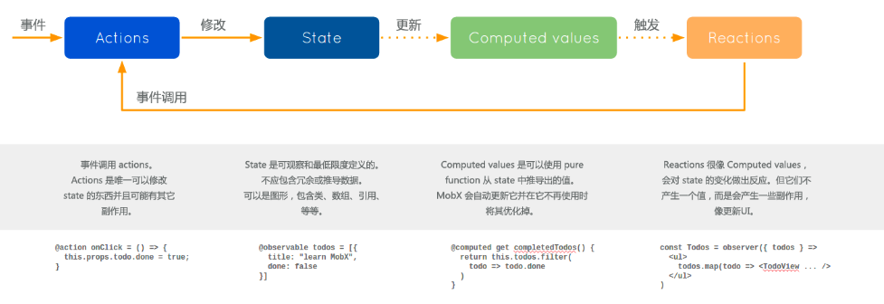

mobx 是一个简单可扩展的状态管理库

## 1.Object.defineProperty

Object.defineProperty(obj,key,descriptors)

1. 设置对象中某个成员的规则

- 如果成员已经存在，则修改其规则
- 如果成员不存在，则新增这个成员，并设置规则「默认所有规则都是 false」

2. 数据劫持

对象“成员”的规则限制：

- Object.getOwnPropertyDescriptor(对象, 成员)：获取对象中某个成员的规则
- Object.getOwnPropertyDescriptors(对象)：获取对象所有成员的规则
- 规则
  - configurable：是否可以删除
  - writable：是否可以更改
  - enumerable：是否可枚举「可以被 for/in 或者 Object.keys 列举出来的属性是可枚举的」
  - value：成员值

## 2.装饰器

1. 类的装饰器

```jsx | pure
@函数
class Xxx{}
创建类的时候，会把装饰器函数执行
```

target：当前装饰的这个类我们可以在装饰器函数中，给类设置一些静态私有的属性方法、或者设置原型上的属性方法等

```jsx | pure
const test = (target) => {
  target.num = 100;
  target.getNum = function getNum() {};
  target.prototype.say = function say() {};
};

@test
class Demo {}

@test
class Child {}
```

编译后的结果

```jsx | pure
var _class;
const test = (target) => {
  target.num = 100;
};
let Demo = test((_class = class Demo {})) || _class;
```

装饰器一般无返回值

```jsx | pure
const test = (target) => {
  // target:Demo
  target.num = 100;
  // 装饰器函数执行的返回结果，会替换原有的类
  // return 100; //=>Demo就是100了
};
@test
class Demo {}
```

同一个类可以使用多个装饰器，处理顺序：从下到上处理

```jsx | pure
const sum = (target) => {
  target.prototype.sum = function sum() {};
};
const staticNum = (target) => {
  target.num = 10;
  target.setNum = function setNum(val) {
    this.num = val;
  };
};

@sum
@staticNum
class Demo {}
```

编译后的代码

```jsx | pure
var _class;
const sum = (target) => {
  // ...
};
const staticNum = (target) => {
  // ...
};
let Demo =
  sum((_class = staticNum((_class = class Demo {})) || _class)) || _class;
```

可以基于传递不同的值，让装饰器函数有不同的效果

```jsx | pure
const test = (x, y) => {
  console.log(1);
  // x:10 y:20
  // 返回的函数是装饰器函数
  return (target) => {
    console.log(2);
    target.num = x + y;
  };
};
const handle = () => {
  console.log(3);
  return (target) => {
    console.log(4);
    target.handle = 'AAA';
  };
};

@test(10, 20)
@handle()
class Demo {}
//=> 1 3 4 2 需要先把外层函数执行，获取装饰器函数后，再按照从下到上的顺序，来执行装饰器函数
```

## 3.基于 mobx 的公共状态管理方案

[mobx](https://cn.mobx.js.org) 是一个简单可扩展的状态管理库，相比较于 redux，它：

> 开发难度低  
> 开发代码量少  
> 渲染性能好



### 浏览器兼容性

MobX >=5 版本运行在任何支持 ES6 proxy 的浏览器。  
MobX 4 可以运行在任何支持 ES5 的浏览器上，而且也将进行持续地维护。MobX 4 和 5 的 API 是相同的，并且语义上也能达到相同的效果。  
MobX 6 「最新版本」移除了装饰器的操作（因为装饰器不是 JS 标准规范）。

### mobx 第五代版本的运用

想要使用 mobx，首先需要让项目支持 JS 装饰器语法

```bash
yarn add @babel/plugin-proposal-decorators @babel/plugin-proposal-class-properties
```

package.json

```json
"babel": {
  "presets": [ "react-app" ],
  "plugins": [
    [
      "@babel/plugin-proposal-decorators",
      {
        /* legacy：
        使用历史遗留（Stage-1）的装饰器中的语法和行为。
        它为提案从 Stage-1 到当前阶段 Stage-2 平稳过渡作铺垫*/
        "legacy": true
      }
    ],
    [
       "@babel/plugin-proposal-class-properties",
       {
         /* loose=false时，是使用Object.defineProperty定义属性，
         loose=ture，则使用赋值法直接定义 */
         "loose": true
       }
     ]
  ]
}
```

安装 mobx 和 mobx-react

```bash
yarn add mobx@5 mobx-react@6
```

初窥 mobx

```jsx | pure
class Store {
  // 公共状态
  @observable num = 10;
  // 修改公共状态的方法
  @action change() {
    this.num++;
  }
}
let store = new Store();

/* 
类组件通过装饰器：
@observer
class Demo extends React.Component {
    render() {
        return <div>
            <span>{store.num}</span>
            <button onClick={() => {
                store.change();
            }}>按钮</button>
        </div>;
    }
} 
*/

/* 函数组件无法使用装饰器的语法，
可以把observer执行，把组件传递进去「这样和装饰器有相同的效果」 
*/
const Demo = observer(function Demo() {
  return (
    <div>
      <span>{store.num}</span>
      <button
        onClick={() => {
          store.change();
        }}
      >
        按钮
      </button>
    </div>
  );
});
```

observable，一个实现“监听值变化”的函数或者装饰器！

```jsx | pure
import { observable, autorun } from 'mobx';

class Store {
  // 只有基于 observable 装饰器修饰的属性，在可以在修改其值后，监测到它的变化
  @observable x = 10;
}
let store = new Store();

// 监听用到的依赖，当依赖改变时会执行callback「最开始立即执行一次」
autorun(() => {
  console.log('autorun:', store.x);
});

// 一秒钟后改变内容
setTimeout(() => {
  store.x = 100;
}, 1000);
```

探索 observable 的原理

```jsx | pure
import { observable, observe } from 'mobx';
let obj = observable({
  x: 10,
  y: 20,
});
// console.log(obj); //对象是经过ES6 Proxy做了劫持处理的
// observe:当监听的对象做出变化时，触发callback
observe(obj, (change) => {
  console.log('内容改变了：', change);
});
obj.x = 100;

// observable不能直接对原始值类型进行监听，需要基于.box处理
let x = observable.box(10);
observe(x, (change) => {
  console.log('内容改变了：', change);
});
console.log(x, x.get());
x.set(1000);
```

computed 计算属性 和 reaction

```jsx | pure
import { observable, autorun, computed, reaction } from 'mobx';
class Store {
  @observable x = 10;
  @observable count = 3;
  @observable price = 120;
  // 设置具备计算缓存的计算属性：
  // 依赖的状态值没有变化，方法不会重新执行，使用之前计算缓存的结果
  @computed get total() {
    console.log('OK');
    return this.count * this.price;
  }
}
let store = new Store();

autorun(() => {
  console.log('autorun:', store.total, store.x);
});
// 相比较于autorun，提供更精细的管控「第一次不会触发」
reaction(
  () => [store.total, store.x],
  () => {
    console.log('reaction:', store.total, store.x);
  },
);

setTimeout(() => {
  store.x = 1000;
  store.count = 10;
}, 1000);
```

action 修改公共状态的方法

```jsx | pure
import { observable, autorun, action, configure } from 'mobx';

// 设定只能基于action方法修改状态值
configure({
  enforceActions: 'observed',
});

class Store {
  @observable x = 10;
  @action changeX(val) {
    this.x = val;
  }
}
let store = new Store();

autorun(() => {
  console.log('autorun:', store.x);
});
setTimeout(() => {
  store.changeX(1000);
  // store.x = 2000;
  //Uncaught Error: [mobx] Since strict-mode is enabled,
  //changing observed observable values outside actions is not allowed.
}, 1000);
```

确保 this 永远是实例

```jsx | pure
class Store {
    @observable x = 10;
    // .bound确保this永远是实例
    @action.bound changeX(val) {
        this.x = val;
    }
}
let store = new Store;
...
setTimeout(() => {
    let changeX = store.changeX;
    changeX(1000);
}, 1000);
```

runInAction

```jsx | pure
class Store {
  @observable x = 10;
}
let store = new Store();

autorun(() => {
  console.log('autorun:', store.x);
});
setTimeout(() => {
  // 基于runInAction代替action修饰器
  //「即便设置enforceActions配置项，它也是被允许的」，和action修饰器具备相同的效果！！
  runInAction(() => {
    store.x = 1000;
  });
}, 1000);
```

实现异步派发

```jsx | pure
// 模拟从服务器获取数据
const query = () => {
  return new Promise((resolve) => {
    setTimeout(() => {
      resolve(1000);
    }, 1000);
  });
};

class Store {
  @observable x = 10;
  @action.bound async changeX() {
    let res = 0;
    try {
      res = await query();
    } catch (_) {}
    this.x = res;
  }
}
let store = new Store();
autorun(() => {
  console.log('autorun:', store.x);
});
store.changeX();
```

### 基于 mobx 重构 TASKOA 案例

### mobx5 的应用

结构目录

```json
|- store
    |- TaskStore.js
    |- PersonalStore.js
    |- index.js
```

store

```jsx | pure
/*PersonalStore.js*/
class PersonalStore {
    constructor(root) {
        this.root = root;
    }
}
export default PersonalStore;

/*TaskStore.js*/
import { observable, action, runInAction } from 'mobx';
import { getTaskList } from '../api';
class TaskStore {
    constructor(root) {
        this.root = root;
    }
    @observable taskList = null;
    // 异步获取全部任务
    @action.bound async queryTaskListAction() {
        let list = [];
        try {
            let result = await getTaskList(0);
            if (+result.code === 0) {
                list = result.list;
            }
        } catch (_) { }
        runInAction(() => {
            this.taskList = list;
        });
    }
    // 同步删除某个任务
    @action.bound removeTaskAction(id) {
        if (!Array.isArray(this.taskList)) return;
        this.taskList = this.taskList.filter(item => {
            return +item.id !== +id;
        });
    }
    // 同步修改某个任务
    @action.bound updateTaskAction(id) {
        if (!Array.isArray(this.taskList)) return;
        this.taskList = this.taskList.map(item => {
            if (+item.id === +id) {
                item.state = 2;
                item.complete = new Date().toLocaleString('zh-CN');
            }
            return item;
        });
    }
}
export default TaskStore;

/*index.js*/
import TaskStore from "./TaskStore";
import PersonalStore from "./PersonalStore";
import { configure } from 'mobx';
configure({
    enforceActions: 'observed'
});
class Store {
    constructor() {
        this.task = new TaskStore(this);
        this.personal = new PersonalStore(this);
    }
}
export default new Store();
```

在组件中的使用

```jsx | pure
/* index.jsx */
import store from './store';
import { Provider } from 'mobx-react';
...
root.render(
    <ConfigProvider locale={zhCN}>
        <Provider {...store}>
            <Task />
        </Provider>
    </ConfigProvider>
);

/* Task.jsx */
import { observer, inject } from 'mobx-react';
const Task = function Task(props) {
    /* 获取TASK模块的Store实例 */
    let { task } = props;

    /* 关于TABLE和数据的处理 */
    useEffect(() => {
        (async () => {
            if (!task.taskList) {
                setTableLoading(true);
                await task.queryTaskListAction();
                setTableLoading(false);
            }
        })();
    }, []);
    useEffect(() => {
        let { taskList } = task;
        if (!taskList) taskList = [];
        if (selectedIndex !== 0) {
            taskList = taskList.filter(item => {
                return +item.state === selectedIndex;
            });
        }
        setTableData(taskList);
    }, [selectedIndex, task.taskList]);

    ......
};
export default inject('task')(observer(Task));
```

### mobx6 的应用

```jsx | pure
/*TaskStore.js*/
import {
  observable,
  action,
  runInAction,
  makeObservable,
  makeAutoObservable
} from 'mobx';
import { getTaskList } from '../api';

class TaskStore {
    constructor(root) {
        this.root = root;
      /*
        makeObservable函数可以捕获已经存在的对象属性并且使得它们可观察
        makeObservable(this, {
            taskList: observable,
            queryTaskListAction: action.bound,
            removeTaskAction: action.bound,
            updateTaskAction: action.bound
        });
      */

      /*
        makeAutoObservable 就像是加强版的 makeObservable，在默认情况下它将推断所有的属性
        推断规则：
            所有自有属性都成为 observable
            所有getters都成为 computed
            所有setters都成为 action
            所有prototype中的 functions 都成为 autoAction
            所有prototype中的 generator functions 都成为 flow
        */
        makeAutoObservable(this);
    }
    taskList = null;
    async queryTaskListAction() {
       ...
    }
    removeTaskAction(id) {
        ...
    }
    updateTaskAction(id) {
        ...
    }
}
export default TaskStore;
```
