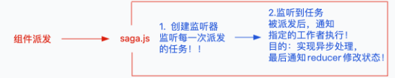
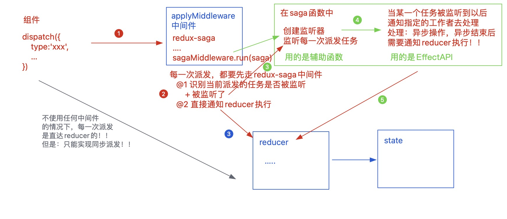

redux-saga 是一个用于管理 **异步获取数据(副作用)** 的 redux 中间件；它的目标是让副作用管理更容易，执行更高效，测试更简单，处理故障时更容易…

学习 redux-saga 之前，需要先掌握 ES6 中的 Iterator 迭代器 和 Generator 生成器 ！！

[官网](https://redux-saga.js.org/docs/About)

[中文网](https://redux-saga-in-chinese.js.org/)

## 1. redux-thunk 与 redux-saga 的比较

### redux 中的数据流

action ———> reducer ———> state

- action 是一个纯粹对象（plain object）
- reducer 是一个纯函数（和外界没有任何关系）
- 都只能处理同步的操作

### redux-thunk 中间件的处理流程

action1 ———> middleware ———> action2 ———> reducer ———> state

```jsx | pure
/* redux-thunk中间件的部分源码 */
function createThunkMiddleware(extraArgument) {
  var middleware = function middleware(_ref) {
    var dispatch = _ref.dispatch,
      getState = _ref.getState;
    return function (next) {
      return function (action) {
        if (typeof action === 'function') {
          // 如果返回的action是个函数，则把函数执行
          //「在函数中完成异步操作，用传递的dispatch单独实现派发！！」
          return action(dispatch, getState, extraArgument);
        }
        return next(action);
      };
    };
  };
  return middleware;
}
```

弊端：异步操作分散到每一个 action 中；而且返回函数中的代码具备多样性！！

### redux-saga 中间件的工作流程

redux-saga 中提供了一系列的 api，可以去监听纯粹对象格式的 action，方便单元测试！！

action1 ———> redux-saga 监听 ———> 执行提供的 API 方法 ———> 返回描述对象 ———> 执行异步操作 ———> action2 ———> reducer ———> state

## 2. redux-saga 的基础知识

### 安装中间件

```bash
npm install redux-saga
```

### 使用中间件

store/index.js

```jsx | pure
import { createStore, applyMiddleware } from 'redux';
import createSagaMiddleware from 'redux-saga';
import reducer from './reducer';
import saga from './saga';
// saga
const sagaMiddleware = createSagaMiddleware();
// 创建store容器
const store = createStore(reducer, applyMiddleware(sagaMiddleware));
// 启动saga
sagaMiddleware.run(saga);
export default store;
```

store/action-types.js

```jsx | pure
export const VOTE_SUP = 'VOTE_SUP';
export const VOTE_OPP = 'VOTE_OPP';
export const DEMO = 'DEMO';
```

store/reducer

```jsx | pure
// demoReducer
import * as TYPES from '../action-types';
import _ from '../../assets/utils';
let initial = {
    num: 0
};
export default function demoReducer(state = initial, action) {
    state = _.clone(state);
    let { payload = 1 } = action;
    switch (action.type) {
        case TYPES.DEMO:
            state.num += payload;
            break;
        default:
    }
    return state;
};

// index.js
import { combineReducers } from 'redux';
import voteReducer from './voteReducer';
import demoReducer from './demoReducer';
const reducer = combineReducers({
    vote: voteReducer,
    demo: demoReducer
});
export default reducer;
```

Demo.jsx 组件中

```jsx | pure
import React from 'react';
import { Button } from 'antd';
import { useSelector, useDispatch } from 'react-redux';
const Demo = function Demo() {
  const { num } = useSelector((state) => state.demo),
    dispatch = useDispatch();
  return (
    <div>
      <span style={{ fontSize: 20, paddingLeft: 10 }}>{num}</span>
      <br />
      <Button
        type="primary"
        onClick={() => {
          //基于dispatch进行派发....
        }}
      >
        按钮
      </Button>
    </div>
  );
};
export default Demo;
```

### saga.js 工作流程



**第一部分：创建监听器「基于 saga 的辅助函数」**

- take(pattern) 创建监听器，监听派发指定标识的异步任务(只会被监听一次)

```jsx | pure
 while (true) {
      let action = yield take(异步标识);
      yield workingCount(action);
 }
```

- takeEvery(pattern, saga, ..args) 等价于上述基于 while(true)的操作，实现一直监听的操作，对异步派发任务的防抖处理「结束边界」
- takeLatest(pattern, saga, ..args) 正在运行的操作都结束掉，只保留当前最新的「也就是最后一次」
- throttle(ms, pattern, saga, ..args) 控制一定的触发频率「依然会触发多次，只不过做了降频」
- debounce(ms, pattern, saga, ..args) 对异步任务的监测做防抖处理，在指定的“ms”时间内，我们触发多次，任务也只能被监测到一次「监测最后一次」，把 working 执行一次！！

**第二部分：创建执行函数「基于 Effect 创建器(API)」**

- put(action) 派发任务到 reducer，等价于 dispatch
- call(fn, 实参 1, 实参 2, ...)
  - 基于 call 方法，可以把指定的函数执行，把实参一项项的传递给方法
  - 真实项目中，我们一般基于 call 方法，实现从服务器获取数据
  - result 就是异步调取接口成功，从服务器获取的信息
- apply(this, fn, [实参 1, 实参 2, ...])
- fork(fn, 实参 1, 实参 2, ...) 以`非阻塞调用`的形式执行方法
- select(selector, …args)
  - 基于 mapState 函数，返回需要使用的公共状态
  - yield 处理后的结果，就是返回的公共状态，可以解构赋值
  ```jsx | pure
  let { num } = yield select(state => state.demo);
  ```
- ...

**每一次组件派发后发生的事情**

每一次在组件中，基于 dispatch(action) 的时候：

首先会通知 reducer 执行

然后再去通知 saga 中的监听器执行



**关于监听器创建的细节**

组件中

```jsx | pure
<Button
  type="primary"
  onClick={() => {
    dispatch({
      type: 'DEMO-SAGA',
      payload: 10,
    });
  }}
>
  按钮
</Button>
```

saga.js -> take 函数的运用

```jsx | pure
import * as TYPES from './action-types';
const working = function* working(action) {
  // 等价于 dispatch派发：通知reducer执行
  yield put({
    type: TYPES.DEMO,
    payload: action.payload,
  });
};
export default function* saga() {
  /*
    创建监听器，当监听到派发后，才会继续向下执行
    特征：只能监听一次
    action：可以获取派发时传递的action
    let action = yield take("DEMO-SAGA");
    yield working(action); 
  */

  // 可基于循环，创建无限监听机制
  while (true) {
    let action = yield take('DEMO-SAGA');
    yield working(action);
  }
}
```

saga.js -> 其它监听器辅助函数的运用

```jsx | pure
const working = function* working(action) {
  console.log('AAA');
  // 设置延迟函数：等待2000ms后，才会继续向下执行！！
  yield delay(2000);
  yield put({
    type: TYPES.DEMO,
    payload: action.payload,
  });
};
export default function* saga() {
  /* // 派发后，立即通知异步的working执行；
    // 但是在working没有处理完毕之前，所有其他的派发任务都不在处理！！
    while (true) {
        let action = yield take("DEMO-SAGA");
        yield working(action);
    } */
  /* // 每一次派发任务都会被执行
    yield takeEvery("DEMO-SAGA", working); */
  /* // 每一次派发任务都会被执行，但是会把之前没有处理完毕的干掉
    yield takeLatest("DEMO-SAGA", working); */
  /* // 每一次派发的任务会做节流处理；在频繁触发的操作中，1000ms内，只会处理一次派发任务
    yield throttle(1000, "DEMO-SAGA", working); */
  /* // 每一次派发的任务会做防抖处理；在频繁触发的操作中，只识别最后一次派发任务进行处理
    yield debounce(1000, "DEMO-SAGA", working); */
}
```

saga.js -> yield call/select…

```jsx | pure
import * as TYPES from './action-types';
import http from '../api/http';

const working = function* working() {
  // 获取目前的公共状态信息
  let { num } = yield select((state) => state.demo);

  // 从服务器获取数据
  // let result = yield apply(null, http.get, ['/api/news/latest']);
  let result = yield call(http.get, '/api/news/latest');
  console.log(result); //从服务器获取的数据

  yield put({
    type: TYPES.DEMO,
  });
};
export default function* saga() {
  yield takeLatest('DEMO-SAGA', working);
}
```

saga.js -> yield fork

```jsx | pure
const query1 = function* query1() {
  console.log(1);
  yield delay(2000);
};
const query2 = function* query2() {
  console.log(2);
  yield delay(2000);
};
const working = function* working() {
  /* // 串行
    yield call(query1);
    yield call(query2); */

  /* // 并行：无阻塞调用
    yield fork(query1);
    yield fork(query2); */

  console.log(3);
};
export default function* saga() {
  yield takeLatest('DEMO-SAGA', working);
}
```

## 3. 基于 redux-saga 重写 Vote 案例

组件

```jsx | pure
import { useSelector, useDispatch } from 'react-redux';
import * as TYPES from '../store/action-types';
...
const Vote = function Vote() {
    const { supNum, oppNum } = useSelector(state => state.vote),
        dispatch = useDispatch();
    return <VoteBox>
        ...
        <div className="footer">
            <Button type="primary"
                onClick={() => {
                    dispatch({
                        type: TYPES.VOTE_SUP
                    });
                }}>
                支持
            </Button>
            <Button type="primary"
                onClick={() => {
                    dispatch({
                        type: "VOTE-SUP-SAGA"
                    });
                }}>
                异步支持
            </Button>

            <Button type="primary" danger
                onClick={() => {
                    dispatch({
                        type: TYPES.VOTE_OPP
                    });
                }}>
                反对
            </Button>
            <Button type="primary" danger
                onClick={() => {
                    dispatch({
                        type: "VOTE-OPP-SAGA"
                    });
                }}>
                反对异步
            </Button>
        </div>
    </VoteBox>;
};
export default Vote;
```

saga.js

```jsx | pure
import { takeLatest, put, delay } from 'redux-saga/effects';
import * as TYPES from './action-types';

const voteSupWorking = function* voteSupWorking() {
  yield delay(2000);
  yield put({
    type: TYPES.VOTE_SUP,
  });
};

const voteOppWorking = function* voteOppWorking() {
  yield delay(2000);
  yield put({
    type: TYPES.VOTE_OPP,
  });
};

export default function* saga() {
  yield takeLatest('VOTE-SUP-SAGA', voteSupWorking);
  yield takeLatest('VOTE-OPP-SAGA', voteOppWorking);
}
```
