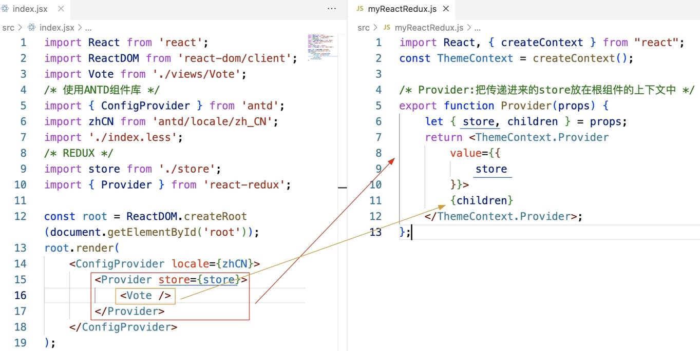
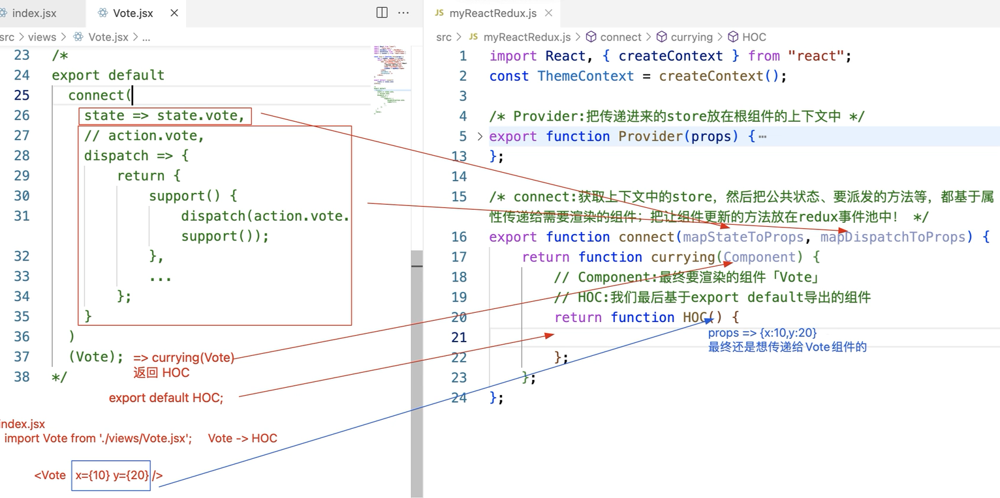

react-redux 是专门为 react 项目封装的 redux 处理库：简化 redux 在组件中的应用代码

## 1.Provider 组件

把 store 挂载到祖先元素的上下文中，方便后期后台组件的调用

```js
import React from 'react';
import ReactDOM from 'react-dom';
import { Provider } from 'react-redux';
import Vote from './component/Vote';
import store from './store';

ReactDOM.render(
  <Provider store={store}>
    <Vote />
  </Provider>,
  document.getElementById('root'),
);
```



## 2.connect 高阶函数

把 redux 容器中存储的状态以及需派发的行为任务都通过属性传递给当前组件

- connect 执行需要传递两个函数
- mapStateToProps：把 redux 容器中的公共状态当做属性传递给当前的组件
- mapDispatchToProps：把需要派发的行为方法通过属性传递给当前的组件

```jsx | pure
import React from 'react';
import { connect } from 'react-redux';
class VoteHead extends React.Component {
  render() {
    let { title, supNum, oppNum } = this.props;
    return (
      <header>
        <h3>{title}</h3>
        <span>N:{supNum + oppNum}</span>
      </header>
    );
  }
}

function mapStateToProps(state) {
  //state:redux容器中的所有公共状态
  //return的值就是当做属性传递给VoteHead的状态信息
  return state.vote;
}
export default connect(mapStateToProps)(VoteHead);
```

```jsx | pure
import React from 'react';
import { connect } from 'react-redux';
import action from '../store/actions';

class VoteFooter extends React.Component {
  render() {
    let { support, oppose } = this.props;
    return (
      <footer>
        <button onClick={support.bind(null, 20)}>支持</button>
        <button onClick={oppose.bind(null, 10)}>反对</button>
      </footer>
    );
  }
}
/* function mapDispatchToProps(dispatch) {
	//dispatch:store.dispatch => dispatch({type:'xxx'...})
	return {
		support(payload) {
			dispatch(action.vote.support(payload));
		},
		oppose(payload) {
			dispatch(action.vote.oppose(payload));
		}
	};
} */
export default connect(null, action.vote)(VoteFooter);

//connect会默认帮我们把actionCreator对象变为mapDispatchToProps这种函数的模式
/* 
connect(null, {
	support(payload) {
		return {
			type: TYPES.VOTE_SUPPORT,
			payload
		};
	},
	oppose(payload) {
		return {
			type: TYPES.VOTE_OPPOSE,
			num: payload
		};
	}
})(VoteFooter); 
*/
```



## 3.自动渲染更新

自动会向事件池中追加当前组件重新渲染的方法，保证状态更新，组件会重新渲染

## 4.my-react-redux

实现 1：

```jsx | pure
import React from 'react';
import PropTypes from 'prop-types';

const ThemeContext = React.createContext();
export class Provider extends React.Component {
  static propTypes = {
    store: PropTypes.object.isRequired,
  };
  render() {
    return (
      <ThemeContext.Provider
        value={{
          store: this.props.store,
        }}
      >
        {this.props.children}
      </ThemeContext.Provider>
    );
  }
}

export function connect(mapStateToProps, mapDispatchToProps) {
  if (typeof mapStateToProps !== 'function') {
    mapStateToProps = function () {
      return {};
    };
  }
  if (typeof mapDispatchToProps !== 'function') {
    if (mapDispatchToProps !== null && typeof mapDispatchToProps === 'object') {
      const actions = mapDispatchToProps;
      mapDispatchToProps = function (dispatch) {
        const obj = {};
        for (let key in actions) {
          if (!actions.hasOwnProperty(key)) break;
          obj[key] = function (...args) {
            dispatch(actions[key](...args));
          };
        }
        return obj;
      };
    } else {
      mapDispatchToProps = function () {
        return {};
      };
    }
  }

  return function connectHOC(Component) {
    return class Proxy extends React.Component {
      static contextType = ThemeContext;
      render() {
        return <Component {...this.queryProps()} />;
      }
      queryProps = () => {
        const store = this.context.store;
        const state = mapStateToProps(store.getState());
        const action = mapDispatchToProps(store.dispatch);
        return {
          ...state,
          ...action,
        };
      };
      componentDidMount() {
        this.context.store.subscribe(() => {
          this.forceUpdate();
        });
      }
    };
  };
}
```

实现 2：

```jsx | pure
import { createContext, useContext, useEffect, useState, useMemo } from 'react';
// import { bindActionCreators } from 'redux';

function bindActionCreators(actionCreators, dispatch) {
  const boundActionCreators = {};

  for (const key in actionCreators) {
    const actionCreator = actionCreators[key];

    if (typeof actionCreator === 'function') {
      boundActionCreators[key] = (...args) => dispatch(actionCreator(...args));
    }
  }

  return boundActionCreators;
}

const ThemeContext = createContext();

/* Provider:把传递进来的store放在根组件的上下文中 */
export function Provider(props) {
  let { store, children } = props;
  return (
    <ThemeContext.Provider
      value={{
        store,
      }}
    >
      {children}
    </ThemeContext.Provider>
  );
}

/* connect:获取上下文中的store，然后把公共状态、要派发的方法等，
 * 都基于属性传递给需要渲染的组件；把让组件更新的方法放在redux事件池中。
 */
export function connect(mapStateToProps, mapDispatchToProps) {
  // 处理默认值
  if (!mapStateToProps) {
    mapStateToProps = () => {
      // 不写则:什么都不给组件传递
      return {};
    };
  }
  if (!mapDispatchToProps) {
    mapDispatchToProps = (dispatch) => {
      // 不写则:把dispatch方法传递给组件
      return {
        dispatch,
      };
    };
  }
  return function currying(Component) {
    // Component:最终要渲染的组件「Vote」
    // HOC:我们最后基于export default导出的组件
    return function HOC(props) {
      // 我们需要获取上下文中的store
      let { store } = useContext(ThemeContext),
        { getState, dispatch, subscribe } = store;

      // 向事件池中加入让组件更新的办法
      let [, forceUpdate] = useState(0);
      useEffect(() => {
        let unsubscribe = subscribe(() => {
          forceUpdate(+new Date());
        });
        return () => {
          // 组件释放的时候执行：把放在事件池中的函数移除掉
          unsubscribe();
        };
      }, []);

      // 把mapStateToProps/mapDispatchToProps，把执行的返回值，作为属性传递给组件！！
      let state = getState(),
        nextState = useMemo(() => {
          return mapStateToProps(state);
        }, [state]);

      let dispatchProps = {};
      if (typeof mapDispatchToProps === 'function') {
        // 是函数直接执行即可
        dispatchProps = mapDispatchToProps(dispatch);
      } else {
        // 是actionCreator对象,需要经过bindActionCreators处理
        dispatchProps = bindActionCreators(mapDispatchToProps, dispatch);
      }

      return <Component {...props} {...nextState} {...dispatchProps} />;
    };
  };
}
```
