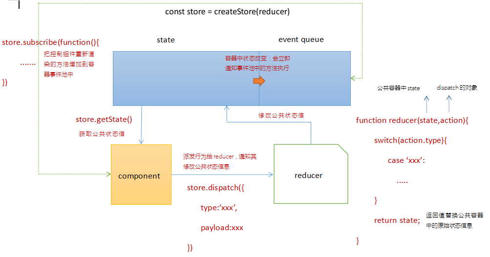

## 1.一张图玩转 Redux



## 2.redux 详细用法

store

```jsx | pure
import { createStore } from '../myredux';

/* 管理员：修改STORE容器中的公共状态 */
let initial = {
  supNum: 10,
  oppNum: 5,
};
const reducer = function reducer(state = initial, action) {
  /* state:存储STORE容器中的公共状态 */
  // =>「最开始没有的时候，赋值初始状态值initial」
  /* action:每一次基于dispatch派发的时候，传递进来的行为对象 */
  // =>「要求必须具备type属性，存储派发的行为标识」/*  */
  /* 为了接下来的操作中，我们操作state，不会直接修改容器中的状态 */
  // =>「要等到最后return的时候」，先克隆
  state = { ...state };
  // 接下来我们需要基于派发的行为标识，修改STORE容器中的公共状态信息
  switch (action.type) {
    case 'VOTE_SUP':
      state.supNum++;
      break;
    case 'VOTE_OPP':
      state.oppNum++;
      break;
    default:
  }
  /* return的内容，会整体替换STORE容器中的状态信息 */
  return state;
};

/* 创建STORE公共容器 */
const store = createStore(reducer);
export default store;
```

VoteMain

```jsx | pure
import React from 'react';
import ThemeContext from '../ThemeContext';

class VoteMain extends React.Component {
  static contextType = ThemeContext;

  render() {
    const { store } = this.context;
    let { supNum, oppNum } = store.getState();

    return (
      <div className="main">
        <p>支持人数：{supNum}人</p>
        <p>反对人数：{oppNum}人</p>
      </div>
    );
  }

  componentDidMount() {
    const { store } = this.context;
    store.subscribe(() => {
      this.forceUpdate();
    });
  }
}

export default VoteMain;
```

VoteFooter

```jsx | pure
import React, { useContext } from 'react';
import { Button } from 'antd';
import ThemeContext from '../ThemeContext';

const VoteFooter = function VoteFooter() {
  const { store } = useContext(ThemeContext);

  return (
    <div className="footer">
      <Button
        type="primary"
        onClick={() => {
          store.dispatch({
            type: 'VOTE_SUP',
          });
        }}
      >
        支持
      </Button>

      <Button
        type="primary"
        danger
        onClick={() => {
          store.dispatch({
            type: 'VOTE_OPP',
          });
        }}
      >
        反对
      </Button>
    </div>
  );
};
export default VoteFooter;
```

Vote

```jsx | pure
import React, { useContext, useState, useEffect } from 'react';
import VoteMain from './VoteMain';
import VoteFooter from './VoteFooter';
import ThemeContext from '../ThemeContext';

const Vote = function Vote() {
  const { store } = useContext(ThemeContext);
  // 获取容器中的公共状态
  let { supNum, oppNum } = store.getState();

  /* 
  组件第一次渲染完毕后，把让组件更新的方法，放在STORE的事件池中
    let [num, setNum] = useState(0);
    const update = () => {
        setNum(num + 1);
    };
    useEffect(() => {
        // let unsubscribe = store.subscribe(让组件更新的方法)
        //   + 把让组件更新的方法放在STORE的事件池中
        //   + 返回的unsubscribe方法执行，可以把刚才放入事件池中的方法移除掉
        let unsubscribe = store.subscribe(update);
        return () => {
            unsubscribe();
        };
    }, [num]); 
 */

  let [_, setNum] = useState(0);
  useEffect(() => {
    store.subscribe(() => {
      setNum(+new Date()); // 让组件更新的方法
    });
  }, []);

  return (
    <div className="vote-box">
      <div className="header">
        <h2 className="title">React是很棒的前端框架</h2>
        <span className="num">{supNum + oppNum}</span>
      </div>
      <VoteMain />
      <VoteFooter />
    </div>
  );
};

export default Vote;
```

## 3.myredux

```jsx | pure
import _ from './assets/utils';

/* 实现redux的部分源码 */
export const createStore = function createStore(reducer) {
  if (typeof reducer !== 'function') {
    throw new Error('Expected the root reducer to be a function');
  }

  let state, //存放公共状态
    listeners = []; //事件池

  /* 获取公共状态 */
  const getState = function getState() {
    // 返回公共状态信息即可
    return state;
  };

  /* 向事件池中加入让组件更新的方法 */
  const subscribe = function subscribe(listener) {
    // 规则校验
    if (typeof listener !== 'function') {
      throw new TypeError('Expected the listener to be a function');
    }
    // 把传入的方法(让组件更新的办法)加入到事件池中「需要做去重处理」
    if (!listeners.includes(listener)) {
      listeners.push(listener);
    }
    // 返回一个从事件池中移除方法的函数
    return function unsubscribe() {
      const index = listeners.indexOf(listener);
      listeners.splice(index, 1);
    };
  };

  /* 派发任务通知 REDUCER 执行 */
  const dispatch = function dispatch(action) {
    // 规则校验
    if (!_.isPlainObject(action)) {
      throw new TypeError('Actions must be plain objects');
    }
    if (typeof action.type === 'undefined') {
      throw new TypeError("Actions may not have an undefined 'type' property");
    }

    // 把reducer执行，传递：公共状态、行为对象；接收执行的返回值，替换公共状态；
    state = reducer(state, action);

    // 当状态更改，我们还需要把事件池中的方法执行
    listeners.forEach((listener) => {
      listener();
    });

    return action;
  };

  /* redux内部会默认进行一次dispatch派发，目的：给公共容器中的状态赋值初始值 */
  const randomstr = () =>
    Math.random().toString(36).substring(7).split('').join('.');
  dispatch({
    type: '@@redux/INIT' + randomstr(),
  });

  /* 返回创建的STORE对象 */
  return {
    getState,
    subscribe,
    dispatch,
  };
};
```
