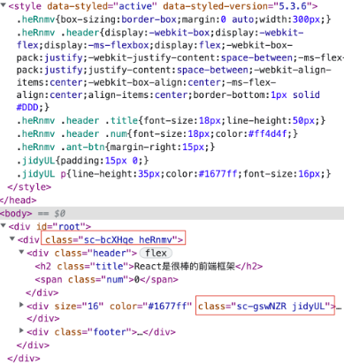

## 1. 内联样式

内联样式就是在 JSX 元素中，直接定义行内的样式

```jsx | pure
// 调用组件的时候 <Demo color="red" />
import React from 'react';
const Demo = function Demo(props) {
  const titleSty = {
    color: props.color,
    fontSize: '16px',
  };
  const boxSty = {
    width: '300px',
    height: '200px',
  };
  return (
    <div style={boxSty}>
      <h1 style={titleSty}>我是标题</h1>
      <h2 style={{ ...titleSty, fontSize: '14px' }}>我是标题</h2>
    </div>
  );
};
export default Demo;
```

编译后的内容

```jsx | pure
<div style="width: 300px; height: 200px;">
  <h1 style="color: red; font-size: 16px;">我是标题</h1>
  <h2 style="color: red; font-size: 14px;">我是标题</h2>
</div>
```

内联样式的优点：

1. 使用简单： 简单的以组件为中心来实现样式的添加
2. 扩展方便： 通过使用对象进行样式设置，可以方便的扩展对象来扩展样式
3. 避免冲突： 最终都编译为元素的行内样式，不存在样式冲突的问题

在大型项目中，内联样式可能并不是一个很好的选择，因为内联样式还是有局限性的：

1. 不能使用伪类： 这意味着 :hover、:focus、:actived、:visited 等都将无法使用
2. 不能使用媒体查询： 媒体查询相关的属性不能使用
3. 减低代码可读性： 如果使用很多的样式，代码的可读性将大大降低
4. 没有代码提示： 当使用对象来定义样式时，是没有代码提示的

## 2. 使用 CSS 样式表

CSS 样式表应该是我们最常用的定义样式的方式！但多人协作开发中，很容易导致组件间的样式类名冲突，从而导致样式冲突；所以此时需要我们 人为有意识的 避免冲突

1. 保证组件最外层样式类名的唯一性，例如：路径名称 + 组件名称 作为样式类名
2. 基于 less、sass、stylus 等 css 预编译语言的嵌套功能，保证组件后代元素都嵌入在外层样式类中

Demo.less

```less
.personal-box {
  width: 300px;
  height: 200px;
  .title {
    color: red;
    font-size: 16px;
  }
  .sub-title {
    .title;
    font-size: 14px;
  }
}
```

Demo.jsx

```jsx | pure
import React from 'react';
import './Demo.less';
const Demo = function Demo(props) {
  return (
    <div className="personal-box">
      <h1 className="title">我是标题</h1>
      <h2 className="sub-title">我是标题</h2>
    </div>
  );
};
export default Demo;
```

CSS 样式表的优点：

1. 结构样式分离： 实现了样式和 JavaScript 的分离
2. 使用 CSS 所有功能： 此方法允许我们使用 CSS 的任何语法，包括伪类、媒体查询等
3. 使用缓存： 可对样式文件进行强缓存或协商缓存
4. 易编写：CSS 样式表在书写时会有代码提示

当然，CSS 样式表也是有缺点的：

1. 产生冲突： CSS 选择器都具有相同的全局作用域，很容易造成样式冲突
2. 性能低： 预编译语言的嵌套，可能带来的就是超长的选择器前缀，性能低！
3. 没有真正的动态样式： 在 CSS 表中难以实现动态设置样式

## 3. CSS Modules

CSS 的规则都是全局的，任何一个组件的样式规则，都对整个页面有效；产生局部作用域的唯一方法，就是使用一个独一无二的 class 名字；这就是 CSS Modules 的做法

第一步：创建 xxx.module.css

```css
.personal {
  width: 300px;
  height: 200px;
}
.personal span {
  color: green;
}
.title {
  color: red;
  font-size: 16px;
}
.subTitle {
  color: red;
  font-size: 14px;
}
```

第二步：导入样式文件 & 调用

```jsx | pure
import React from 'react';
import sty from './demo.module.css';
const Demo = function Demo() {
  return (
    <div className={sty.personal}>
      <h1 className={sty.title}>我是标题</h1>
      <h2 className={sty.subTitle}>我是标题</h2>
      <span>我是标题</span>
    </div>
  );
};
export default Demo;
```

编译后的效果

```jsx | pure
// 结构
<div class="demo_personal__dlx2V">
    <h1 class="demo_title__tN+WF">我是标题</h1>
    <h2 class="demo_subTitle__rR4WF">我是标题</h2>
    <span>我是标题</span>
</div>

// 样式
.demo_personal__dlx2V {
    height: 200px;
    width: 300px
}
.demo_personal__dlx2V span {
    color: green
}
.demo_title__tN\+WF {
    color: red;
    font-size: 16px
}
.demo_subTitle__rR4WF {
    color: red;
    font-size: 14px
}
```

react 脚手架中对 CSS Modules 的配置

```jsx | pure
// react-dev-utils/getCSSModuleLocalIdent.js
const loaderUtils = require('loader-utils');
const path = require('path');
module.exports = function getLocalIdent(
  context,
  localIdentName,
  localName,
  options,
) {
  // Use the filename or folder name, based on some uses the index.js / index.module.(css|scss|sass) project style
  const fileNameOrFolder = context.resourcePath.match(
    /index\.module\.(css|scss|sass)$/,
  )
    ? '[folder]'
    : '[name]';
  // Create a hash based on a the file location and class name. Will be unique across a project, and close to globally unique.
  const hash = loaderUtils.getHashDigest(
    path.posix.relative(context.rootContext, context.resourcePath) + localName,
    'md5',
    'base64',
    5,
  );
  // Use loaderUtils to find the file or folder name
  const className = loaderUtils.interpolateName(
    context,
    fileNameOrFolder + '_' + localName + '__' + hash,
    options,
  );
  // Remove the .module that appears in every classname when based on the file and replace all "." with "_".
  return className.replace('.module_', '_').replace(/\./g, '_');
};
```

全局作用域  
CSS Modules 允许使用 :global(.className) 的语法，声明一个全局规则。凡是这样声明的 class，都不会被编译成哈希字符串。

```jsx | pure
// xxx.module.css
:global(.personal) {
    width: 300px;
    height: 200px;
}

// xxx.jsx
const Demo = function Demo() {
    return <div className='personal'>
        ...
    </div>;
};
```

class 继承/组合  
在 CSS Modules 中，一个选择器可以继承另一个选择器的规则，这称为”组合”

```jsx | pure
// xxx.module.css
.title {
    color: red;
    font-size: 16px;
}
.subTitle {
    composes: title;
    font-size: 14px;
}

// 组件还是正常的调用，但是编译后的结果
<h1 class="demo_title__tN+WF">我是标题</h1>
<h2 class="demo_subTitle__rR4WF demo_title__tN+WF">我是标题</h2>
```

## 4. React-JSS

JSS 是一个 CSS 创作工具，它允许我们使用 JavaScript 以生命式、无冲突和可重用的方式来描述样式。JSS 是一种新的样式策略！ ​React-JSS 是一个框架集成，可以在 React 应用程序中使用 JSS。它是一个单独的包，所以不需要安装 JSS 核心，只需要 React-JSS 包即可。React-JSS 使用新的 Hooks API 将 JSS 与 React 结合使用。 ​

```jsx | pure
import React from 'react';
import { createUseStyles } from 'react-jss';
const useStyles = createUseStyles({
  personal: {
    width: '300px',
    height: '200px',
    // 基于 & 实现样式嵌套
    '& span': {
      color: 'green',
    },
  },
  title: {
    // 使用动态值
    color: (props) => props.color,
    fontSize: '16px',
  },
  // 使用动态值
  subTitle: (props) => {
    return {
      color: props.color,
      fontSize: '14px',
    };
  },
});
const Demo = function Demo(props) {
  const { personal, title, subTitle } = useStyles(props);
  return (
    <div className={personal}>
      <h1 className={title}>我是标题</h1>
      <h2 className={subTitle}>我是标题</h2>
      <span>我是标题</span>
    </div>
  );
};
export default Demo;
```

编译后的效果

```jsx | pure
// html结构
<div class="personal-0-2-16">
    <h1 class="title-0-2-17 title-d0-0-2-19">我是标题</h1>
    <h2 class="subTitle-0-2-18 subTitle-d1-0-2-20">我是标题</h2>
    <span>我是标题</span>
</div>

// css样式
.personal-0-2-16{
    width: 300px;
    height: 200px;
}
.title-d0-0-2-19{
    color: red;
}
.title-0-2-17{
    font-size: 16px;
}
.personal-0-2-16 span{
    color: green;
}
```

但是从 react-jss 第 10 版本之后，不支持在类组件中使用，只能用于函数组件中！如果想在类组件中使用，还需我们自己处理一下

```jsx | pure
import React from 'react';
import { createUseStyles } from 'react-jss';
const useStyles = createUseStyles({
    ...
});
// 高阶组件
const withStyles = function withStyles(Component) {
    return function (props) {
        const styles = useStyles(props);
        return <Component {...styles} />;
    };
};
class Demo extends React.Component {
    render() {
        const { personal, title, subTitle } = this.props;
        return <div className={personal}>
            ...
        </div>;
    }
}
export default withStyles(Demo);
```

## 5. styled-components

目前在 React 中，还流行 CSS-IN-JS 的模式：也就是把 CSS 像 JS 一样进行编写；其中比较常用的插件就是 styled-components

```bash
$ yarn add styled-components
```

[styled-components](https://styled-components.com/docs/basics#getting-started)

**创建一个样式的 js 文件，例如：style.js**  
想要有语法提示，可以安装 vscode 插件：vscode-styled-components

```jsx | pure
import styled from 'styled-components';

// 创建公共的样式变量
const colorBlue = '#1677ff',
  colorRed = '#ff4d4f';

// 基础用法
export const VoteBox = styled.div`
  box-sizing: border-box;
  margin: 0 auto;
  width: 300px;

  .header {
    display: flex;
    justify-content: space-between;
    align-items: center;
    border-bottom: 1px solid #ddd;

    .title {
      font-size: 18px;
      line-height: 50px;
    }

    .num {
      font-size: 18px;
      color: ${colorRed};
    }
  }

  .ant-btn {
    margin-right: 15px;
  }
`;

// 使用传递的属性，动态设置样式  &&  给属性设置默认值！！
export const VoteMain = styled.div.attrs((props) => {
  return {
    color: props.color || colorBlue,
  };
})`
  padding: 15px 0;

  p {
    line-height: 35px;
    color: ${(props) => props.color};
    font-size: ${(props) => props.size}px;
  }
`;
```

组件中使用

```jsx | pure
import { VoteBox, VoteMain } from './style';

const Demo = function Demo() {
  return (
    <VoteBox>
      <div className="header">
        <h2 className="title">React是很棒的前端框架</h2>
        <span className="num">0</span>
      </div>
      <VoteMain size={16}>
        <p>支持人数：0人</p>
        <p>反对人数：0人</p>
        <p>支持比率：--</p>
      </VoteMain>
      <div className="footer">
        <Button type="primary">支持</Button>
        <Button type="primary" danger>
          反对
        </Button>
      </div>
    </VoteBox>
  );
};

export default Demo;
```

编译后的效果：



上面介绍了几种常用的 React 样式策略，这几种策略并没有绝对的好或坏，都各有优缺点，可以根据实际的业务场景去使用。
